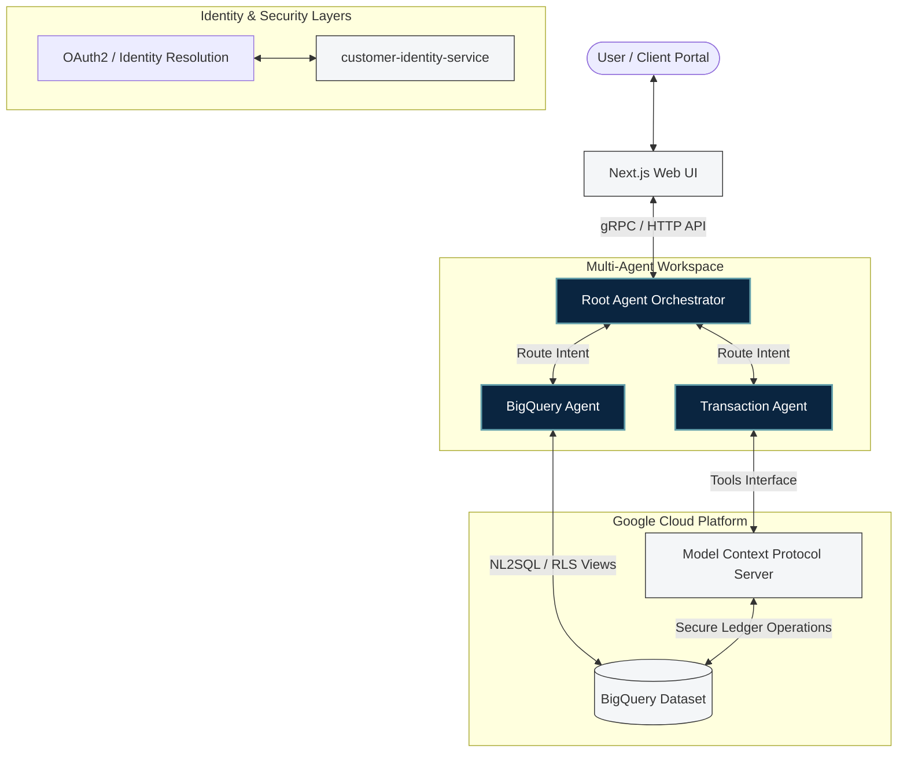
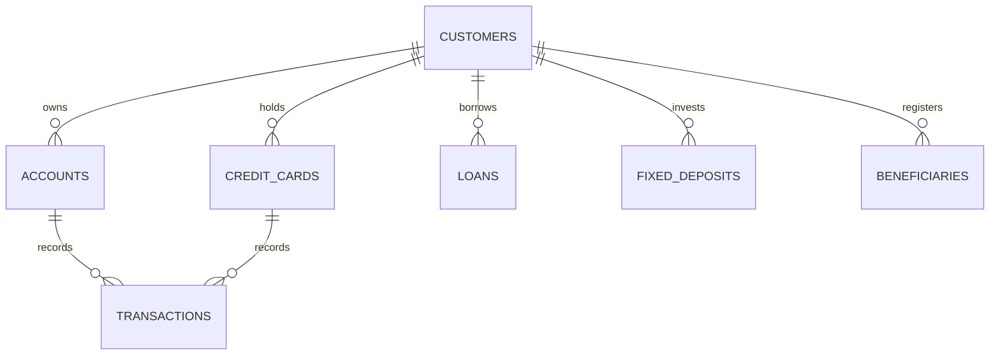

# 🏦 ApexBanking: Production-Grade Multi-Agent AI Banking Portal

ApexBanking is an enterprise-grade AI-powered financial operations and analytics portal. Built with Google's **Agent Development Kit (ADK)**, **Model Context Protocol (MCP)**, and **BigQuery**, it showcases a sophisticated multi-agent orchestrator capable of performing natural language data analysis (**NL2SQL**) and secure, ledger-consistent financial transactions.

The system features a premium, responsive **Next.js** chat interface, a robust identity resolution service, and a transactional double-entry ledger engine.

---

## 🏗️ Architectural Blueprint

ApexBanking uses a **Dual-Agent Architecture** overseen by a central orchestration router (**Root Agent**).



### Flow Sequences

1.  **Analytical Inquiries (Data Query Flow)**:
    *   The user requests a spend analysis (e.g., *"What was my highest shopping expense last month?"*).
    *   The **Root Agent** routes the request to the **BigQuery Agent**.
    *   The BigQuery Agent dynamically generates a valid, optimal SQL query matching the customer's schema.
    *   The query is executed against **Row-Level Security (RLS)** views in BigQuery, strictly isolating data.
2.  **Financial Operations (Transaction Flow)**:
    *   The user requests a transfer or payment (e.g., *"Transfer ₹5,000 to Raj"*).
    *   The **Root Agent** routes the request to the **Transaction Agent**.
    *   The Transaction Agent triggers secure operations on the **MCP Server**.
    *   The MCP Server performs business-rule validation (balance check, account verification) and executes a **dual-row ledger update** in BigQuery under a secure transaction.

---

## 💎 Product Suite & Key Features

*   **Multi-Agent Coordination**: Root orchestrator performs conversational routing, maintaining high coherence and safety constraints.
*   **Dynamic NL2SQL Translation**: High-fidelity SQL translation designed to support complex aggregations, joins, and Slowly Changing Dimensions (SCD).
*   **Double-Entry Ledger Model**: Secure money movements represented as matched DEBIT/CREDIT pairs sharing a unique `reference_id` to prevent data inconsistencies or balance leakage.
*   **Slowly Changing Dimensions (SCD Type 2)**: Maintained history of critical banking dimensions (Customers, Accounts, Credit Cards) with tracking parameters (`is_current`, `eff_start_ts`, `eff_end_ts`, `record_version`).
*   **Row-Level Security (RLS)**: Enforced isolation ensuring customers only gain access to their own authorized accounts, transactions, and metrics.
*   **Premium Web UI**: Responsive Next.js application built with native scroll containers, a step-by-step AI activity timeline tracker, and beautiful dark banking aesthetics.

---

## 🗂️ Project Directory Structure

```text
banking-agent/
├── app/                                 # Multi-Agent Orchestration Engine (ADK)
│   ├── agent.py                         # Central Root Router & Intent Classifier
│   ├── prompts.py                       # Behavioral instructions and safety guidelines
│   ├── tools.py                         # Inter-agent routing tools
│   └── sub_agents/                      # Specialized agents
│       ├── bigquery/                    # SQL Generation & Data Analytics Agent
│       └── transaction/                 # Transaction Validation & Execution Agent
├── mcp_server/                          # Transactional Tool Interface (FastMCP)
│   ├── server.py                        # OAuth2 validated entrypoints
│   └── tools.py                         # Ledger operations (Transfers, Card Payments, FDs)
├── customer-identity-service/           # Identity Resolution FastAPI Microservice
│   ├── app/                             # Core service and repositories
│   └── Dockerfile                       # Microservice container definition
├── infra/                               # Cloud Infrastructure & Data Pipelines
│   ├── bq_schema/                       # Terraform Infrastructure definitions
│   │   ├── main.tf                      # BigQuery datasets, tables, & schema configurations
│   │   ├── variables.tf                 # Terraform variables
│   │   └── outputs.tf                   # Terraform output URLs
│   └── data_scripts/                    # Data Generation & ETL Pipelines
│       ├── generate_data.py             # Highly-aligned SCD and transaction generator
│       └── upload_to_bigquery.py        # Bulk BigQuery loader
├── nextjs/                              # Premium React Client Portal
│   ├── src/                             # Pages, layouts, and Tailwind components
│   └── package.json                     # Frontend dependencies
├── Makefile                             # Unified dev-ops automation commands
├── PROJECT_SUMMARY.md                   # Architectural deep-dive
└── README.md                            # This file
```

---

## 🏛️ Ledger & SCD Type 2 Data Model

ApexBanking implements a robust banking schema designed specifically to showcase advanced analytics over complex, structured relational datasets.



### 1. Slowly Changing Dimensions (SCD Type 2)
To preserve audit trails and historical balances, the **Customers**, **Accounts**, and **Credit Cards** tables employ SCD Type 2. Every schema modifications increments the `record_version` and manages effective timestamps:
*   `eff_start_ts`: Active start timestamp.
*   `eff_end_ts`: Active end timestamp (NULL if current).
*   `is_current`: Boolean indicating the current active profile.

### 2. Transaction Double-Entry Ledger
All transfers generate exactly two corresponding records in the `transactions` table under a shared `reference_id`:
*   **DEBIT Record**: Records the outflow on the sender's `account_number`.
*   **CREDIT Record**: Records the inflow on the receiver's `account_number`.

This guarantees auditing completeness and eliminates balance sync issues during ledger calculations.

---

## 🚀 Quick Start Guide

### Prerequisites
*   Python 3.10+ (using `uv` is recommended for high-performance dependency tracking)
*   Node.js 18+ & npm
*   Google Cloud Platform (GCP) project with BigQuery enabled
*   Terraform (>= 1.0)

---

### Step 1: Environment Configuration

Create a `.env` file in the project root:

```env
# Google Cloud Configuration
GOOGLE_CLOUD_PROJECT=your-gcp-project-id
GOOGLE_CLOUD_LOCATION=us-central1
GOOGLE_APPLICATION_CREDENTIALS=./keys/service-account.json

# BigQuery Target Specs
BQ_PROJECT_ID=your-gcp-project-id
BQ_DATASET_ID=banking_data

# LLM Models Configuration
ROOT_AGENT_MODEL=gemini-2.5-pro
TRANSACTION_AGENT_MODEL=gemini-2.5-flash
BIGQUERY_AGENT_MODEL=gemini-2.5-pro

# Client Portal Specs
CUSTOMER_EMAIL_ID=souravmaiti1997@gmail.com
```

---

### Step 2: Set Up Infrastructure & BigQuery Schemas

Deploy the BigQuery tables, views, and dataset constraints automatically using Terraform:

```bash
make bq-setup
```

---

### Step 3: Populate Aligned Datasets

Generate a high-fidelity dataset with matched transaction histories, and load them to your GCP BigQuery instance:

```bash
# Generate localized synthetic datasets (creates highly aligned CSV records in data/)
make generate-data

# Upload the records directly to BigQuery tables
make upload-data
```

---

### Step 4: Run the Services Locally

You can launch the complete ecosystem (Next.js portal, multi-agent server, and FastAPI customer identity service) using a single command:

```bash
make dev
```

The services will start concurrently:
*   **Frontend Client**: `http://localhost:3000`
*   **Multi-Agent Server**: `http://localhost:8501`
*   **Identity Resolution Service**: `http://localhost:8080`

---

## 🔐 Enterprise-Grade Security Framework

1.  **Row-Level Security (RLS)**: Enforced on all analytical views. The BigQuery Agent queries user-authorized views that automatically filter records by comparing the authenticated session's `customer_id` / `email` against the requested rows.
2.  **Service Account Least-Privilege**: The agent and MCP servers use highly restricted Service Accounts limited specifically to BigQuery jobs execution and dataset write permissions.
3.  **Two-Step Transaction Execution**: The Transaction Agent employs a secure verification flow, validating counterparty identities, account numbers, and funding source limits before pushing actions to the MCP server.

---

## 📊 Summary of Synthetic Data Generation Alignment

To provide realistic scenarios for the analytics engine, the synthetic data generator automatically enforces:
*   **Logical Category Mapping**: Standardizes merchants to their precise transactional domains (e.g., `Uber` -> `TRAVEL`, `Starbucks` -> `FOOD`, `Amazon` -> `SHOPPING`).
*   **Unified Utilities Mapping**: Groups power, broadband, and gas payments under designated `UTILITIES` channels.
*   **SCD State Coherence**: Ensures transaction histories occur chronologically within the effective dates of the respective account version.

---

## 🙋 Support & Diagnostics

1.  Run the linter and verification suite:
    ```bash
    make lint
    ```
2.  Inspect schema alterations or historical records in the [BigQuery Console](https://console.cloud.google.com/bigquery).
3.  Ensure your service account key file path matches `GOOGLE_APPLICATION_CREDENTIALS` precisely.

---

*Built with the Google Agent Development Kit (ADK), Model Context Protocol (MCP), and Google Cloud Platform.*
