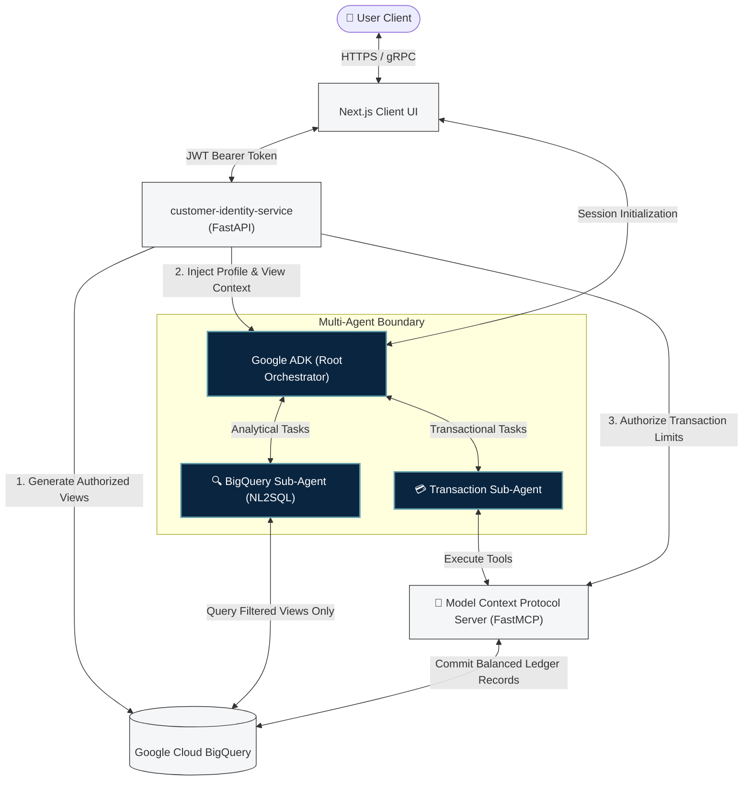
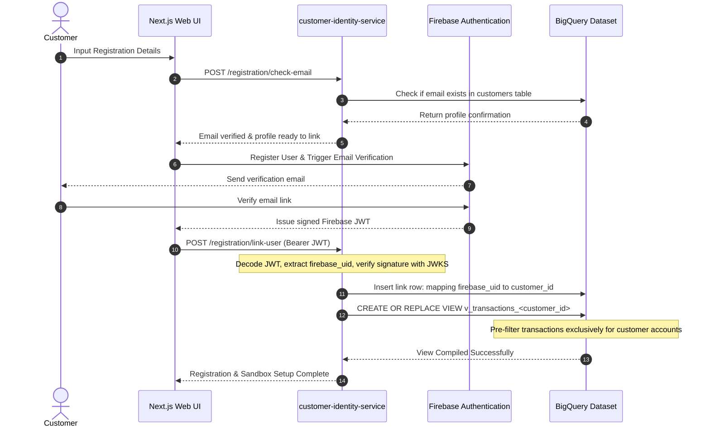
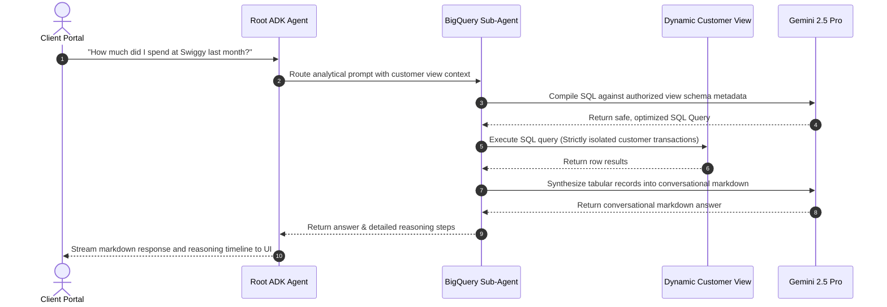

# 🏦 BankPilot: Secure AI Financial Portal

Production-inspired AI Banking Platform featuring Google ADK, Vertex AI Agent Engine, Firebase Authentication, Customer Identity Service, and secure BigQuery tool execution.

[](https://cloud.google.com/vertex-ai)
[](https://adk.dev/)
[](https://cloud.google.com/bigquery)
[](https://firebase.google.com)
[](https://www.terraform.io)

---

## 🏗️ Architecture Overview

BankPilot separates client-side interactions, identity resolution, and analytical databases. The diagram below illustrates the system interaction and data boundaries:



---

## 📊 System Statistics

The following statistics represent the current, actual implementation of the BankPilot repository:

| Metric / Component | Verified Repository Value |
| :--- | :--- |
| **Application Services** | **4 Services** (Next.js Web UI, FastAPI Identity Service, FastMCP Server, Google ADK Root Agent) |
| **BigQuery Datasets** | **1 Dataset** (`banking_data`) |
| **Database Tables** | **9 Relational Tables** (Customers, Identity Mapping, Accounts, Beneficiaries, Transactions, Cards, Loans, Deposits, Credit Scores) |
| **Synthetic Customers** | **1,300 profiles** with verified demographics and segmentation (Retail, Wealth) |
| **Synthetic Transactions** | **453,145 records** comprising a multi-year historical double-entry ledger (~56MB) |
| **Cloud Infrastructure** | **Google Cloud Platform** (Vertex AI Agent Engine, Cloud Run, BigQuery, Firebase Auth, Secret Manager, Cloud Logging) |
| **Programming Languages** | **Python 3.10+** (Backend microservices, ADK agents, MCP tools) & **TypeScript / React** (Next.js web portal) |
| **Infrastructure-as-Code** | **HashiCorp Terraform** (automates regional dataset, schema generation, and column-level semantic documentation) |

---

## 📖 Project Overview

### The Problem It Solves
Modern financial institutions possess vast data lakes, but extracting real-time personal analytics and executing transaction operations remains bottlenecked by rigid, legacy client portals.

### Why Traditional Generative AI Demos Fail
Most LLM-based database chat assistants are built as proof-of-concept demos with critical structural flaws:
1.  **Direct Database Access**: They allow the LLM to write raw SQL directly against backend database tables, opening catastrophic vectors for prompt-injection SQL execution.
2.  **Unverified Identity Claims**: They rely on identity values passed directly by the client browser (e.g., *"I am customer 123"*), ignoring standard token authentication.
3.  **Lax Ledger Safety**: They write balance updates to loose, non-auditable records, failing basic transactional consistency.

### Our Solution
BankPilot is built on secure, modular, and cloud-native software engineering practices:
*   **Cryptographic Verification**: Validates short-lived Firebase JWT tokens in-memory at the API gateway.
*   **Isolated Data Sandboxes**: Restricts database queries to dynamically compiled, customer-specific BigQuery views.
*   **Structured Ledger Tracking**: Enforces atomic, double-entry ledger transactions (`DEBIT` and `CREDIT` balance records) for all financial operations.
*   **Separation of Concerns**: Splits AI tasks between analytical models (SQL compilers) and action models (execution tools), reducing hallucination risk.

---

## 🔐 Customer Onboarding & Session Flow

A core principle of this architecture is: **Never trust client-side claims.** 

The client UI never passes a raw `customer_id`. Instead, users authenticate via Firebase, and the resulting JWT token is verified by the backend to compile a secure user data sandbox.

### Onboarding & Verification Sequence
The sequence below illustrates the customer registration and view compilation process:



### Brief Step Explanation:
1.  **Check Email Availability**: The user initiates registration. Next.js requests the backend to verify if a matching customer profile exists in the core banking records.
2.  **Verify & Authenticate**: Once verified, the user registers with Firebase Authentication, completes the email verification handshake, and obtains a cryptographically signed JWT.
3.  **Establish Secure Link**: Next.js sends the JWT to the `customer-identity-service`. The service verifies the signature using Google's public keys (JWKS), extracts the `firebase_uid`, and maps it securely to the database `customer_id`.
4.  **Sandbox Compilation**: The backend dynamically compiles customer-specific BigQuery authorized views, restricting the data context exclusively to accounts owned by that user.

---

## 🤖 Multi-Agent Execution Flow

This chart details how natural language analytical prompts are safely converted into optimized database executions without exposing base tables:



---

## 🎯 Why Google ADK?

Google's **Agent Development Kit (ADK)** was selected as the foundational multi-agent framework rather than building a custom orchestration layer or using alternative libraries.

### Key Architectural Advantages
1.  **Native Gemini Primitives**: Built specifically for Vertex AI, ADK integrates with Gemini's low-latency streaming and system-instruction compilers, bypassing heavy middleware wrappers.
2.  **Tool Abstraction & Isolation**: ADK separates conversational memory from execution capabilities. Sub-agents are restricted to narrow, predefined tool arrays.
3.  **Managed Agent Engine Hosting**: ADK applications package cleanly as stateful `AdkApp` components deployed directly onto **Vertex AI Agent Engine**. This serverless runtime manages execution sandboxing, session state preservation, and fine-grained GCP IAM security.
4.  **Predictable Context Routing**: The framework implements native routing logic that prevents conversational state and variables from bleeding across concurrent user sessions.

### Architecture Trade-offs
*   **The Benefit**: We avoid writing complex, error-prone conversational state managers, LLM tool-calling loops, and custom stream-propagation layers. ADK handles multi-turn state and streaming out-of-the-box.
*   **The Cost**: Standardizing on ADK ties the agent hosting and orchestration directly to the Google Cloud / Vertex AI ecosystem, making multi-cloud container migrations more complex than standard Docker-based FastAPI architectures.

---

## 🔐 Data Security & SQL Accuracy

### Dynamic Sandboxing
BankPilot guarantees data isolation at the database layer. The AI Agent's database credentials grant no read access to the base `transactions` or `accounts` tables. Instead, the `customer-identity-service` creates a custom view pre-filtered on the user's specific account numbers.
If a prompt injection attack attempts to access other users' data, the compiled query executes within the restricted view, which structurally contains no other users' rows.

### Enhancing SQL Compilation with Semantic Metadata
Generative models running text-to-SQL tasks frequently hallucinate table joins and column names. To address this, BankPilot attaches rich, context-heavy metadata descriptions directly to database columns using Terraform:

```hcl
# Example Terraform schema-level documentation
resource "google_bigquery_table" "transactions" {
  dataset_id = "banking_data"
  table_id   = "transactions"
  
  schema = <<EOF
  [
    {
      "name": "account_number",
      "type": "STRING",
      "mode": "REQUIRED",
      "description": "Business meaning: The bank account on which this entry is recorded. Links to accounts, credit_cards, fixed_deposits, or loans."
    }
  ]
  EOF
}
```

The BigQuery agent's retrieval tools pull this column documentation dynamically. Providing deep business-level relationships and context allows Gemini 2.5 Pro to compile queries with exceptional precision, eliminating join hallucinations.

---

## 🔌 API Documentation

All REST routes are hosted under `/api/v1` of the `customer-identity-service`:

| Endpoint | Method | Authentication Required | Purpose |
| :--- | :---: | :---: | :--- |
| `/registration/check-email` | `POST` | No | Checks if user email corresponds to an active customer profile. |
| `/registration/link-user` | `POST` | Yes | Securely links a newly registered `firebase_uid` with a database `customer_id`. |
| `/auth/me` | `GET` | Yes | Decodes credentials to return customer name, segment, and verified KYC flags. |
| `/adk/context` | `GET` | Yes | Creates dynamic BigQuery customer views and returns authorized account limits to initialize ADK. |

---

## 🌐 Deployment Infrastructure

1.  **Frontend Client**: Hosted on **Firebase Hosting** CDN for fast visual assets loading and static JS page deliveries.
2.  **API Microservice**: The FastAPI `customer-identity-service` is containerized and deployed on **Google Cloud Run**, autoscaling from 0 to 10 instances.
3.  **Agent Orchestration**: Deployed directly on **Vertex AI Agent Engine** as a managed `AdkApp`, ensuring secure execution and native tracing.
4.  **Database & Storage**: Maintained on **Google Cloud BigQuery** regional clusters, using clustered partitioning on `transaction_timestamp` to optimize query costs.

---

## ⚡ Current Capabilities

### Phase 1 (Implemented)
*   ✅ **Customer onboarding**
*   ✅ **Firebase Authentication**
*   ✅ **Customer Identity Service**
*   ✅ **Customer-scoped BigQuery Views**
*   ✅ **Google ADK SQL Agent**
*   ✅ **Natural language banking queries**
*   ✅ **Cloud deployment**

### Phase 2 (In Progress)
*   ⬜ **MCP Transaction Service**
*   ⬜ **OTP Verification**
*   ⬜ **CI/CD**
*   ⬜ **Observability**
*   ⬜ **Analytics Copilot**

---

## 🚧 Current Limitations & Roadmap

To demonstrate engineering maturity, the following list outlines known technical limitations of the current implementation:

1.  **Single-Region Deployment**: Resources are hosted in a single GCP region (`us-central1`); there is no active-active multi-region database replication.
2.  **Direct BigQuery Resolution**: The system lacks an intermediate caching layer (e.g., Redis). The `customer-identity-service` creates views and retrieves profile context directly from BigQuery on every session bootstrap, introducing network latency.
3.  **No Distributed Tracing**: Microservice boundaries lack unified distributed tracing (such as OpenTelemetry or Jaeger) to track request propagation from Next.js to the BigQuery engine.
4.  **No Rate Limiting**: REST and gRPC endpoints currently lack concurrency limits or DDoS protection rules.
5.  **Audit Log Persistence**: Service logs are streamed to Google Cloud Logging, but there is no tamper-proof, dedicated write-once-read-many (WORM) audit database for transaction histories.
6.  **OTP Flow Mocked**: The registration sequence defines OTP structures, but the physical verification layer is bypassed and auto-approved in the mock context.

---

## 💡 Engineering Decisions & Lessons Learned

### 1. Data Sandboxing via Views
*   **Problem**: Direct database table access by LLMs poses extreme risk of cross-tenant data leaks via creative prompt injection.
*   **Decision**: Dynamic compilation of authorized customer views at session startup.
*   **Trade-off**: Increases BigQuery database metadata creation overhead, but achieves complete tenant data separation.
*   **Outcome**: High resistance to data exfiltration attacks; the database strictly isolates user boundaries before the SQL runs.

### 2. Database Column-Level Documentation as Code
*   **Problem**: Standard NL2SQL models frequently hallucinate join fields or field names on custom banking schemas.
*   **Decision**: Manage detailed column documentation and relationships inside Terraform definitions, making schemas the single source of truth.
*   **Trade-off**: Requires strict discipline to update Terraform metadata whenever table structures evolve.
*   **Outcome**: Significantly reduced join-field hallucinations, resulting in reliable query execution.

### 3. UI Scrolling & Layout Boundaries
*   **Problem**: Streaming interactive timelines in web chat interfaces often causes layout shifting and lag on mobile viewports.
*   **Decision**: Enforced rigid native layout scroll boundaries and decoupled streaming timelines from the central chat thread.
*   **Trade-off**: Slightly increases frontend CSS layout complexity.
*   **Outcome**: Perfect rendering performance on small screen devices (Pixel 7 / iPhone SE) with zero layout shifting during live stream rendering.

---

## 📷 Interface Placeholders

### 🔑 Login Portal
> [!NOTE]
> **Interface Placeholder: Login Portal**
> *   **URL / Route**: `/login`
> *   **Primary Flow**: Client credential authentication utilizing Firebase OAuth2.
> *   **Visual Elements**: Secure input fields for customer email/password, integration with Firebase Client SDK, JWT token generation, and secure redirect to dashboard.

### 💬 Conversational Analytics Portal
> [!NOTE]
> **Interface Placeholder: Conversational Analytics Portal**
> *   **URL / Route**: `/dashboard/chat`
> *   **Primary Flow**: Interactive conversational interface utilizing Google ADK and Vertex AI Agent Engine.
> *   **Visual Elements**: Real-time streaming response window, interactive thought/reasoning timeline, expandable step-by-step execution details, and live transaction/spend analytics charts.

### 📊 Sandboxed SQL Views
> [!NOTE]
> **Interface Placeholder: BigQuery Authorized Views**
> *   **Location**: Google Cloud Console -> BigQuery
> *   **Primary Flow**: Physically isolating account records via customer-scoped views dynamically compiled at session startup.
> *   **Visual Elements**: Dynamic view schema `v_transactions_<customer_id>` mapped with column-level descriptions, executing isolation logic without direct table exposure to LLMs.

---

## 🎬 Live Session Demonstration

Below is a simulated walk-through of an interactive user session:

```text
[Customer Logs In with secure email] -> Next.js resolves Firebase JWT Token
[Next.js initializes Session Context] -> customer-identity-service dynamic view compiled

Customer: "What was my highest expense last month?"

AI Agent Thought Timeline:
  ├── 🔍 Route Classified: Analytical Query -> Delegating to BigQuery Agent
  ├── 📁 Fetching sandbox schema: v_transactions_1113959832841516
  ├── 🧠 Prompting Gemini 2.5 Pro with view schema & semantic metadata
  ├── 💻 Executing compiled SQL:
  │    SELECT category, SUM(amount) AS total 
  │    FROM `banking_data.v_transactions_1113959832841516`
  │    WHERE transaction_timestamp >= '2026-05-01'
  │    GROUP BY category ORDER BY total DESC LIMIT 1
  └── 📊 Database returned: "FOOD", Total: ₹12,500

AI Response:
"Your highest expense category last month was **FOOD** (totaling ₹12,500), primarily driven by transactions at Swiggy and Zomato."

Customer: "Transfer ₹1,500 to Raj"

AI Agent Thought Timeline:
  ├── 🔍 Route Classified: Transactional Action -> Delegating to Transaction Agent
  ├── 🔌 Activating FastMCP tool: get_beneficiary(name="Raj")
  ├── 👤 Beneficiary verified: Raj (Savings Account ending in *5678)
  └── 🛡️ Enforcing confirmation guardrail: Prompting customer for verification

AI Response:
"I have verified Raj's savings account ending in **5678**. Please confirm: do you want to transfer ₹1,500?"
```

---

## 🚀 Local Development Setup

### Prerequisites
*   Python 3.10+ (using `uv` is highly recommended)
*   Node.js 18+ & npm
*   Google Cloud Platform project with BigQuery enabled
*   Terraform (>= 1.0)

### 1. Configure Local Environment File
Create a `.env` file from the universal template:
```bash
cp .env.example .env
```
Ensure that `GOOGLE_APPLICATION_CREDENTIALS` points to a valid local Google Service Account key file with BigQuery and Vertex AI Admin privileges.

### 2. Set Up Infrastructure & Schemas
Compile the BigQuery schemas and tables automatically using Terraform:
```bash
make bq-setup
```

### 3. Populating Test Datasets
Generate aligned, realistic customer profiles and matched transaction histories, and load them to your BigQuery dataset:
```bash
# Generate high-fidelity synthetic datasets (data/ folder)
make generate-data

# Load the generated files directly to BigQuery tables
make upload-data
```

### 4. Running the Complete Stack
Concurrently start the client portal UI, the FastAPI identity resolution server, and the multi-agent server:
```bash
make dev
```
*   **Web Portal UI**: `http://localhost:3000`
*   **Agent Server**: `http://localhost:8501`
*   **Identity Resolver**: `http://localhost:8080`

---

*Developed with the Google Agent Development Kit (ADK), Model Context Protocol (MCP), and Google Cloud Platform.*
