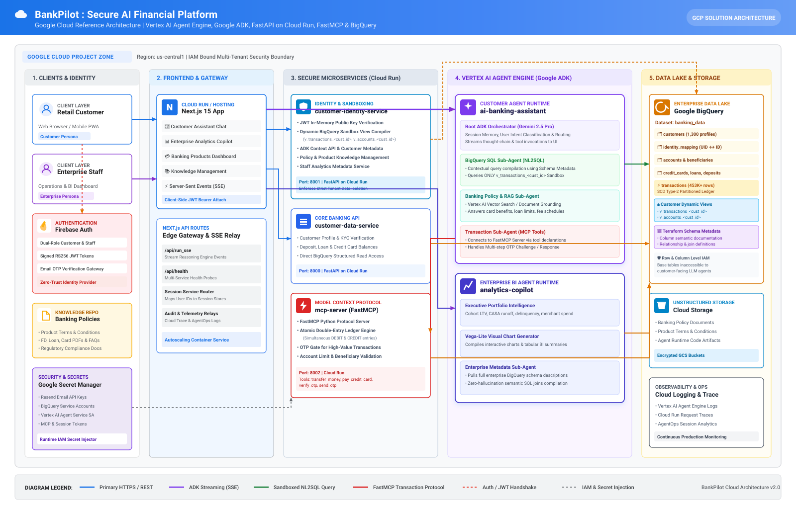

# 🏦 BankPilot

### Enterprise Agentic AI Platform for Intelligent, Secure Banking

> **Built for the [All Things Agentic Hackathon](https://allthingsagentichackathon.devpost.com/)**
>
> BankPilot is an enterprise-grade multi-agent banking platform that enables customers and business stakeholders to securely analyze financial data, execute banking workflows, retrieve grounded policy information, and make informed decisions using specialized AI agents.

[](https://cloud.google.com/)
[](https://google.github.io/adk-docs/)
[](https://cloud.google.com/)
[](https://cloud.google.com/run)
[](https://github.com/jlowin/fastmcp)
[](https://cloud.google.com/bigquery)
[](https://firebase.google.com)

🔗 **Live Demo:** https://bankpilot.souravmaiti.dev/  
💻 **Repository:** https://github.com/souravmighty/banking-agent

---

## 🎬 Demo

<p align="center">
  
</p>

---

## 🏗️ Architecture Overview

[](docs/images/bankpilot_architecture.svg)

<p align="center">
  <a href="https://excalidraw.com/#json=tiuLVFxKRiD07hCjuK-Zu,zdv4vl9gnJyq2ibLmrY_-w" target="_blank">
    
  </a>
</p>

```text
                        ┌──────────────────────────────┐
                        │         Next.js UI           │
                        │                              │
                        │ Customer Portal              │
                        │ Staff / Analytics Dashboard  │
                        └──────────────┬───────────────┘
                                       │
                              Firebase Authentication
                                       │
                                       ▼
                  ┌─────────────────────────────────────┐
                  │      Customer Identity Service      │
                  │                                     │
                  │ • Customer Registration             │
                  │ • JWT Authorization                 │
                  │ • Role-Based Access Control         │
                  │ • Customer Context                  │
                  │ • BigQuery Authorized Views         │
                  └──────────────┬──────────────────────┘
                                 │
               ┌─────────────────┴──────────────────┐
               ▼                                    ▼
   ┌───────────────────────────────┐   ┌───────────────────────────────┐
   │      AI Banking Assistant     │   │       Analytics Copilot       │
   │                               │   │                               │
   │ Root Agent                    │   │ Root Analytics Agent          │
   │                               │   │                               │
   │ ├─ Query Agent (NL2SQL)       │   │ ├─ Investigation Agent        │
   │ ├─ Transaction Agent (MCP)    │   │ ├─ NL2SQL Agent               │
   │ ├─ RAG Agent                  │   │ ├─ Visualization Agent        │
   │ └─ Recommendation Logic       │   │ └─ RAG Retrieval              │
   └───────────────┬───────────────┘   └───────────────┬───────────────┘
                   │                                   │
          ┌────────┴────────┐                 ┌────────┴─────────┐
          ▼                 ▼                 ▼                  ▼
   ┌─────────────┐   ┌──────────────┐   ┌──────────────┐  ┌──────────────┐
   │ FastMCP     │   │ Agent        │   │ BigQuery     │  │ Agent        │
   │ Server      │   │ Platform     │   │ Analytics    │  │ Platform     │
   │             │   │ RAG Engine   │   │              │  │ RAG Engine   │
   │ Transactions│   │              │   │ Authorized   │  │              │
   │ OTP / Limits│   │ Enterprise   │   │ Data Views   │  │ Enterprise   │
   │ Payments    │   │ Knowledge    │   │ (SCD Type 2) │  │ Knowledge    │
   └──────┬──────┘   └──────────────┘   └──────────────┘  └──────────────┘
          │
          ▼
   ┌────────────────┐
   │ Banking Engine │
   │ Accounts       │
   │ Credit Cards   │
   │ Beneficiaries  │
   │ Atomic Ledger  │
   └────────────────┘
```

---

## 🏆 Hackathon Alignment & Enterprise Blueprint

BankPilot is purpose-built to meet and exceed all judging criteria for the **All Things Agentic Hackathon**, specifically targeting the **Fortified Enterprise Fleet** category while incorporating high-utility **TaskMaster** autonomous execution and **Collaborative Partner** human-in-the-loop adaptation.

### Mandatory Technology Verification
| Hackathon Requirement | BankPilot Implementation | Verification Evidence |
| :--- | :--- | :--- |
| **Gemini 3.5 or newer** | **Gemini 3.7 Flash** across Root Orchestrators, NL2SQL, and RAG agents | Integrated via Agent Platform (`ROOT_AGENT_MODEL=gemini-3.7-flash`) |
| **Google Agent Framework** | **Google ADK (Agent Development Kit)** | Root multi-agent controllers, custom tool bindings, session state, and eval runners |
| **Google Cloud Infrastructure** | **Cloud Run, BigQuery, Firebase, Cloud Logging, Cloud Trace** | Production microservices on Cloud Run, partitioned datasets in BigQuery, JWT via Firebase |

### Enterprise Agentic Pillars (Judging Stage Two Alignment)
1. **Innovation & Operational Utility (40%)**:
   - **Eliminates Critical Real-World Friction**: Solves the security risks of direct LLM SQL access and unverified client claims by dynamically compiling zero-trust BigQuery customer sandbox views and requiring step-up email OTP for high-value transactions.
   - **The "Twist"**: Goes beyond chat into an autonomous financial action engine executing double-entry atomic ledger writes over FastMCP and an enterprise intelligence copilot performing multi-intent query decomposition with interactive Vega-Lite charts.
   - **The Unlikely Hero**: Empowers both everyday retail banking customers and non-technical internal compliance, risk, and branch managers to diagnose multi-dimensional root causes (e.g. variance, churn, funnel drop-offs) without writing SQL.
2. **Architectural Discipline & Tech Stack (30%)**:
   - **Strict Separation of Concerns**: Isolates analytical reasoning (NL2SQL), transactional writes (FastMCP tools), grounded knowledge retrieval (RAG), and data visualization into decoupled, failure-tolerant sub-agents.
   - **Zero-Trust Tool Isolation**: Agent tools are treated as privileged capabilities. FastMCP enforces server-side JWT validation, beneficiary ownership checks, spending limit thresholds, and atomic balance reconciliation.
   - **Evolving Knowledge Engine**: Agent Platform RAG Engine features metadata-driven access control (Customer vs. Staff) and an automated document versioning/upsert strategy to eliminate stale policy hallucinations.
3. **Demo & Production Readiness (30%)**:
   - **Live Production URL**: Fully deployed and operational at [bankpilot.souravmaiti.dev](https://bankpilot.souravmaiti.dev/).
   - **Reproducible Spin-Up**: Comprehensive Makefile and Terraform automation for instant local testing and cloud deployment.
   - **Google ADK Quality Flywheel**: Automated evaluation suites testing RAG groundedness, SQL compilation precision, latency, and adversarial prompt-injection resistance.

---

# 🎯 The Problem

Modern banking systems contain massive amounts of structured financial data and unstructured knowledge, but accessing that information remains difficult.

### Customers frequently need to:
- Understand their accounts and historical transaction behavior.
- Transfer money and pay credit card bills securely.
- Navigate complex banking policies, fee schedules, and product terms.
- Receive personalized product recommendations based on real spending patterns.

### Banking staff and business stakeholders need to:
- Investigate changes in portfolio performance and business metrics.
- Diagnose root causes behind anomalies and customer drop-offs.
- Perform cohort, funnel, variance, and period-over-period trend analysis.
- Extract answers from enterprise data lakes without manually writing complex SQL.
- Access internal SOPs and risk policies while maintaining strict data access boundaries.

### Why Traditional Chatbots Fail:
1. **Direct Database Exposure**: Traditional LLMs write raw SQL directly against base database tables, creating severe prompt-injection vulnerabilities and data exfiltration risks.
2. **Unverified Identity Claims**: Demos frequently trust raw client-provided identity strings (e.g., `"customer_id: 123"`), lacking cryptographically verified token authentication.
3. **Lax Ledger Safety**: Standard chatbots cannot execute real financial transactions with atomicity, daily limits, and step-up authentication.
4. **Hallucinated Policies**: Generic chatbots hallucinate terms and conditions rather than grounding answers in access-controlled official documentation.
5. **No Multi-Step Analytics**: Simple chat loops cannot decompose multi-dimensional business questions into structured mathematical investigations.

---

## 💡 The BankPilot Solution

**BankPilot transforms banking interactions from simple chat into secure, agent-driven workflows.**

The platform uses specialized AI agents that can:
1. **Understand user intent** and delegate tasks to specialized sub-agents.
2. **Query authorized banking data** using natural language over pre-filtered data sandboxes.
3. **Execute secure banking actions** through Model Context Protocol (FastMCP) tools.
4. **Enforce step-up OTP verification** for high-value money transfers.
5. **Retrieve grounded answers** from an enterprise knowledge base with role-based access control.
6. **Analyze financial patterns** and recommend eligible banking products.
7. **Perform multi-step analytics investigations** using structured analytical patterns.
8. **Generate interactive Vega-Lite data visualizations** automatically.
9. **Maintain enterprise-grade authorization, auditability, and observability** via Agent Platform.

---

# 🚀 Why BankPilot Is Agentic

BankPilot is intentionally architected to operate beyond standard chat loops. A user request triggers a multi-step, autonomous workflow:

```text
Understand Intent
      ↓
Retrieve Authorized Context (Zero-Trust JWT & Sandbox)
      ↓
Route to Specialized Sub-Agent (ADK Multi-Agent Nexus)
      ↓
Execute Tools / Queries / Retrieval (FastMCP & Agent Platform RAG)
      ↓
Validate Results & Mathematical Consistency
      ↓
Request Human Confirmation / Step-Up OTP When Required
      ↓
Execute Secure Action (Atomic Double-Entry Ledger)
      ↓
Generate Grounded Response with Citations
      ↓
Capture Telemetry and Evaluation Signals (Agent Platform Observability)
```

### Real-World Agentic Flow Example:
> *"Analyze my spending pattern over the last 3 months and recommend a suitable credit card."*

1. **Context Provisioning**: Authenticates the customer via JWT and identifies pre-compiled BigQuery sandbox views.
2. **Data Extraction**: The Query Sub-Agent compiles and executes SQL against the customer's authorized transaction view.
3. **Behavioral Analysis**: Calculates category-wise expenditure (e.g., dining, travel, fuel, groceries).
4. **Knowledge Retrieval**: The RAG Sub-Agent queries the Agent Platform RAG Engine for credit card product guides authorized for customer access.
5. **Grounded Synthesis**: Cross-references customer spending thresholds with official reward multiplier rules from the documentation.
6. **Transparent Explanation**: Explains exactly why the card is recommended, citing specific spending figures and official product benefits.

---

# 🤖 Core Agent Systems

BankPilot consists of two major agentic experiences:

---

## 1️⃣ AI Banking Assistant (Customer Fleet)

The **AI Banking Assistant** is the customer-facing agent, orchestrating account insights, financial guidance, and secure transaction execution.

### Key Capabilities
- **Account & Balance Queries**: Real-time checking, savings, deposit, and credit card balances.
- **Transaction Ledger Analysis**: Natural language spending summaries, category aggregations, and merchant lookups.
- **Spending Insights**: Period-over-period budget and expenditure breakdowns.
- **Policy & Knowledge Q&A**: Grounded answers on interest rates, fee waivers, loan eligibility, and KYC rules.
- **Personalized Recommendations**: Context-aware product recommendations based on real customer data.
- **Secure Money Transfers**: Peer-to-peer and beneficiary transfers executed through FastMCP.
- **Credit Card Bill Payments**: Seamless card balance settlement.
- **Transaction Limit Management**: Customer-managed step-up OTP thresholds.
- **Step-Up OTP Authentication**: Real-time email verification for transfers above configured limits.

```text
Customer: "How much did I spend on food last month?"

Customer Request
       ↓
Root ADK Agent (Intent Classification)
       ↓
Query Sub-Agent (NL2SQL)
       ↓
Customer-Authorized BigQuery View (Zero-Trust Filter)
       ↓
Transaction Aggregation & Analysis
       ↓
Validated Conversational Response
```

---

### 💸 Secure Transaction Execution with FastMCP

BankPilot uses a dedicated **Model Context Protocol (FastMCP)** server to expose secure banking tools to the Transaction Agent. The AI agent never directly touches the underlying database tables.

```text
AI Agent
   │
   ▼
Transaction Agent
   │
   ▼
FastMCP Transaction Server
   │
   ├── 1. Authorization Validation (JWT & Customer Context)
   │
   ├── 2. Beneficiary Validation (Registered & Active)
   │
   ├── 3. Available Balance Validation (Sufficient Funds)
   │
   ├── 4. Transaction Limit Check (Configured OTP Threshold)
   │
   └── 5. Step-Up OTP Verification (If Amount > Threshold)
          │
          ▼
     Execute Transaction (Atomic Double-Entry Ledger)
```

#### Supported Banking Actions:
- **💰 Money Transfer**: Validates source account ownership, beneficiary registration, active status, and sufficient balance before executing atomic debit and credit entries.
- **💳 Credit Card Bill Payment**: Validates card ownership, outstanding balance, and linked payment account funds.
- **⚙️ Customer Transaction Limit Management**: Allows customers to adjust their step-up OTP threshold (e.g., *"Change my OTP limit to ₹10,000"*).

---

### 🔐 Step-Up OTP Transaction Protection

BankPilot implements human-in-the-loop step-up authentication for high-value operations.

- **Default Transaction Threshold**: **₹5,000** (user-configurable via MCP).
- **Workflow**: Transactions above the threshold trigger dynamic OTP generation, dispatched securely via email using **Resend**.
- **Security Controls**:
  - Cryptographically secure 6-digit OTP generation.
  - Short-lived TTL expiration (5 minutes).
  - Single-use validation with attempt-rate limiting.
  - Transaction-bound token signing (cannot be reused for a different transfer).
  - Immediate invalidation upon successful execution.
  - Zero plaintext OTP storage.

```text
Customer Initiates Transfer (> ₹5,000)
            │
            ▼
     Validate Authorization & Limits
            │
            ▼
      Threshold Exceeded: Generate OTP
            │
            ▼
      Send OTP Email via Resend
            │
            ▼
      Customer Enters OTP in Chat
            │
            ▼
      FastMCP Verifies OTP & Binds Action
            │
            ▼
      Execute Atomic Ledger Transfer
```

---

## 2️⃣ Analytics Copilot (Enterprise Intelligence Fleet)

The **Analytics Copilot** enables bank executives, branch managers, and risk analysts to conduct deep multi-dimensional investigations across enterprise banking datasets using natural language.

```text
Business Question: "Why did loan applications decrease compared to last quarter?"
       │
       ▼
Root Analytics Agent
       │
       ├───────────────────────────────┐
       ▼                               ▼
Analytical Pattern Engine     Ambiguity Detection / HITL
       │                               │
       ▼                               ▼
Query Decomposition ──────────────► Hypothesis Selection
       │
       ▼
Parallel Multi-Intent Investigation
       │
       ├──── BigQuery NL2SQL Agent (Enterprise Data)
       ├──── Analytical Sub-Agent (Statistical Math)
       └──── Visualization Agent (Vega-Lite Compiler)
       │
       ▼
Mathematical Reconciliation & Cross-Validation
       │
       ▼
Interactive Visualization & Executive Briefing
```

### 🔎 Analytical Pattern Engine
The copilot automatically classifies business questions into structured analytical investigation patterns:
- **Variance & Period-over-Period Analysis**: Compares metrics across calendar and fiscal periods.
- **Driver & Metric Decomposition**: Breaks aggregated KPIs into underlying drivers (e.g., volume vs. rate effects).
- **Funnel & Conversion Drop-off Analysis**: Identifies friction points in multi-stage customer journeys.
- **Cohort Retention Analysis**: Tracks customer behavior and retention across onboarding cohorts.
- **Anomaly Detection & Root-Cause Diagnostics**: Isolates unexpected deviations in transaction volumes or deposit flows.

### ⚡ Parallel Multi-Intent Investigation
Complex inquiries containing multiple questions (e.g., *"Why did revenue fall last quarter, which products contributed most, and was customer churn involved?"*) are automatically decomposed into parallel sub-agent tasks, executed concurrently against BigQuery, and reconciled into a unified analytical summary.

### 📈 Interactive Data Visualization
The **Visualization Agent** compiles validated **Vega-Lite** specifications rendered dynamically on the Next.js frontend:
- Waterfall charts for revenue and balance walks.
- Multi-series trend charts with moving averages.
- Conversion funnel diagrams.
- Cohort retention heatmaps.
- Anomaly confidence interval bands.

---

# 📚 Enterprise Knowledge Base (Agent Platform RAG Engine)

BankPilot incorporates an enterprise knowledge pipeline powered by **Agent Platform RAG Engine** to eliminate hallucinations and ground agent responses in verified bank policies.

```text
Staff Uploads Document (.pdf, .md, .txt)
          │
          ▼
Knowledge Management Portal
          │
          ▼
Metadata Extraction & Access Control Tagging (Customer vs Staff)
          │
          ▼
Agent Platform RAG Engine
          │
          ├── Semantic Chunking & Embedding
          └── Vector Storage & Indexing
                   │
                   ▼
             Enterprise Knowledge Corpus
```

### 🔄 Document Versioning & Upsert Strategy
When bank staff upload an updated policy (e.g., revised interest rates or fee schedules):
1. The system identifies existing chunks associated with the document identifier.
2. Previous vector embeddings are pruned and replaced.
3. The new version is indexed with updated metadata.
4. Agents immediately retrieve current policy information, eliminating stale retrieval data.

### 🔐 Role-Based Knowledge Access Control
Documents are tagged with audience permissions to strictly segregate customer-facing information from internal procedures:

| Document | Customer Access | Staff Access |
| :--- | :---: | :---: |
| **Savings Account Product Guide** | ✅ | ✅ |
| **Credit Card Reward Tiers & Rules** | ✅ | ✅ |
| **Internal Risk & AML SOP** | ❌ | ✅ |
| **Branch Operations Escalation Matrix** | ❌ | ✅ |

- **AI Banking Assistant**: Retrieves only `Customer`-authorized knowledge chunks.
- **Analytics Copilot**: Retrieves `Staff`-authorized documentation and internal operational context.

---

# 🗄️ Secure Enterprise Data Access

BankPilot enforces zero-trust data boundaries through the **Customer Identity Service**.

```text
Customer / Staff UI
   │
   ▼
Firebase Authentication (JWT)
   │
   ▼
Customer Identity Service (Validates Signature & Decodes UID)
   │
   ▼
Dynamic BigQuery Authorized View (Pre-filtered on Customer Account IDs)
   │
   ▼
BigQuery Core Banking Tables (Base tables remain strictly protected)
```

### 🔐 Zero-Trust Security Controls
- **Cryptographic JWT Verification**: In-memory JWKS signature verification on every request.
- **Dynamic BigQuery Sandboxes**: Customers only query authorized views (`v_transactions_<customer_id>`), making SQL prompt injection structurally incapable of reading other accounts.
- **Column-Level Semantic Documentation as Code**: Managed via Terraform, attaching rich business context to database columns to eliminate join hallucinations during NL2SQL generation.
- **Strict Read/Write Decoupling**: Query agents operate in read-only mode; state-changing transactions are exclusively routed through FastMCP with explicit validation.

---

## 📂 Repository Structure

```
banking-agent/
├── ai-banking-assistant/                   # Customer-facing banking assistant (Agent Platform Agent Engine)
│   ├── app/
│   │   ├── agent.py                        # Root ADK multi-agent orchestrator & session lifecycle manager
│   │   ├── fast_api_app.py                 # Local FastAPI server wrapper for debugging & local SSE streams
│   │   ├── prompts.py                      # System instructions & conversational guidelines for Gemini
│   │   ├── tools.py                        # Core agent tools (RAG document retriever, schema context tools)
│   │   ├── app_utils/                      # Reasoning engine adapter, A2A messaging & backend services
│   │   └── sub_agents/
│   │       └── bigquery/                   # Customer NL2SQL sub-agent querying authorized sandbox views
│   ├── deployment/
│   │   ├── local.py                        # Local agent testing runner
│   │   ├── remote.py                       # Agent Platform Reasoning Engine remote deployment runner
│   │   └── terraform/                      # Infrastructure-as-Code for CI/CD & Cloud Run staging
│   ├── deployment_metadata.json            # Active Agent Platform Reasoning Engine resource IDs & GCP metadata
│   ├── tests/                              # Unit, integration, load, and ADK quality evaluation test suites
│   └── pyproject.toml                      # Package specifications & dependencies for ai-banking-assistant
│
├── analytics-copilot/                      # Enterprise Business Intelligence copilot for staff & operations
│   ├── app/
│   │   ├── agent.py                        # Root BI orchestrator routing analytical queries & chart requests
│   │   ├── fast_api_app.py                 # Local FastAPI server wrapper for staff BI endpoints
│   │   ├── prompts.py                      # Enterprise portfolio & cohort analytics system instructions
│   │   ├── tools.py                        # Metric aggregation & BigQuery schema discovery tools
│   │   └── sub_agents/
│   │       ├── bigquery/                   # Enterprise NL2SQL sub-agent querying core banking tables
│   │       └── visualization/              # Chart sub-agent compiling interactive Vega-Lite visual specs
│   ├── deployment/                         # Remote deployment runners and Terraform configurations
│   ├── deployment_metadata.json            # Reasoning Engine runtime IDs for analytics-copilot
│   ├── tests/                              # BI evaluation datasets, response quality tests & load tests
│   └── pyproject.toml                      # Package configuration for analytics-copilot
│
├── customer-identity-service/              # Core authentication & security microservice (FastAPI on Cloud Run)
│   ├── app/
│   │   ├── main.py                         # FastAPI application entry point, CORS & middleware configuration
│   │   ├── config.py                       # Environment configuration & GCP Project/Dataset bindings
│   │   ├── dependencies.py                 # JWT token decoding, signature verification & user dependency injection
│   │   ├── repositories/                   # Data access layer for customer identity, demo users & knowledge docs
│   │   ├── routers/
│   │   │   ├── auth.py                     # User profile retrieval & Firebase token authentication routes
│   │   │   ├── registration.py             # Email availability checks & Firebase UID ↔ Customer ID linking
│   │   │   ├── adk.py                      # Dynamic customer sandbox view compiler & ADK context initialization
│   │   │   ├── knowledge.py                # Banking policy document upload, indexing & retrieval routes
│   │   │   └── demo.py                     # Seed demo personas & instant login switcher endpoints
│   │   ├── schemas/                        # Pydantic request/response data validation models
│   │   ├── services/                       # Business logic (BigQuery view creation, Firebase Admin SDK, RAG)
│   │   └── utils/                          # Logger, custom exceptions, email templates & demo setup scripts
│   ├── tests/                              # Integration tests for auth, metadata & view generation
│   ├── Dockerfile                          # Production container specification for Google Cloud Run
│   └── requirements.txt                    # Service Python dependencies
│
├── customer-data-service/                  # Core banking domain data microservice (FastAPI on Cloud Run)
│   ├── app/
│   │   ├── main.py                         # FastAPI application entry point & CORS configuration
│   │   ├── config.py                       # Environment variables & BigQuery dataset configuration
│   │   ├── dependencies.py                 # Firebase authentication dependencies & bearer token verification
│   │   ├── routers/
│   │   │   └── dashboard.py                # Banking product summary routes (accounts, cards, loans, deposits)
│   │   └── services/
│   │       ├── bigquery_service.py         # Direct structured SQL queries against core banking tables
│   │       └── dashboard_service.py        # Customer financial snapshot aggregation & payload formatting
│   ├── Dockerfile                          # Cloud Run container image specification
│   └── requirements.txt                    # Service Python dependencies
│
├── mcp-server/                             # Model Context Protocol (FastMCP) transaction server (Cloud Run)
│   ├── app/
│   │   ├── server.py                       # FastMCP server setup & protocol transport handlers
│   │   ├── tools.py                        # Tool definitions (transfer_money, pay_credit_card, verify_otp)
│   │   ├── auth.py                         # FastMCP JWT authentication & caller identity validation
│   │   ├── ledger_service.py               # Atomic double-entry ledger engine (simultaneous DEBIT & CREDIT)
│   │   ├── limit_service.py                # Daily spending limit enforcement & beneficiary account validation
│   │   ├── otp_service.py                  # One-time password generation & verification for high-value transfers
│   │   └── schemas.py                      # FastMCP tool input/output data schemas
│   ├── terraform/                          # Terraform infrastructure modules for Cloud Run deployment & IAM
│   ├── tests/                              # Unit & integration tests for ledger, limits, OTP & MCP tools
│   ├── Dockerfile                          # Cloud Run containerization
│   └── requirements.txt                    # FastMCP dependencies
│
├── nextjs/                                 # Full-stack banking web portal & enterprise staff dashboard (Next.js 15)
│   ├── src/
│   │   ├── app/                            # Next.js App Router pages and API endpoints
│   │   │   ├── page.tsx                    # Landing page & persona selector (Customer vs Staff)
│   │   │   ├── dashboard/                  # Customer financial overview dashboard page
│   │   │   ├── accounts/                   # Savings & checking accounts detail page
│   │   │   ├── credit-cards/               # Credit card overview, limits & billing page
│   │   │   ├── loans/                      # Personal & home loan schedules page
│   │   │   ├── fixed-deposits/             # Active fixed deposit certificates page
│   │   │   ├── transactions/               # Searchable historical transaction ledger page
│   │   │   ├── knowledge/                  # Customer banking policy & product search page
│   │   │   ├── staff/                      # Enterprise staff portal (Analytics Copilot & demo manager)
│   │   │   └── api/
│   │   │       ├── run_sse/                # Edge API route proxying SSE streaming from Agent Platform Agent Engine
│   │   │       └── health/                 # Health check proxy across all microservices
│   │   ├── components/
│   │   │   ├── chat/                       # Chat interface, message timeline, session selector & Markdown renderer
│   │   │   ├── staff/                      # Staff portal layout, analytics chat header & BI empty states
│   │   │   ├── ui/                         # Reusable UI component library (buttons, dialogs, cards, sonner)
│   │   │   └── AuthProvider.tsx            # Firebase auth context provider & session listener
│   │   ├── hooks/                          # Custom React hooks (useAuth, useStreaming, useSession, useBackendHealth)
│   │   ├── lib/                            # API clients, session history managers, SSE stream handlers & utilities
│   │   ├── firebase/                       # Client-side Firebase SDK configuration
│   │   └── types/                          # TypeScript definitions for customer profiles, accounts & chat events
│   ├── package.json                        # Frontend dependencies & Next.js build scripts
│   └── tailwind.config.ts                  # Tailwind CSS styling and theme configuration
│
├── bigquery-infra/                         # Infrastructure-as-Code & synthetic data pipelines
│   ├── bq_schema/
│   │   ├── main.tf                         # Terraform BigQuery dataset & table definitions with column metadata
│   │   ├── analytics_views.tf              # Terraform views for staff portfolio intelligence & executive KPIs
│   │   ├── variables.tf                    # Project IDs, region & dataset configuration variables
│   │   └── outputs.tf                      # Exported BigQuery table IDs & dataset self-links
│   ├── data/                               # Pre-generated synthetic CSV datasets (customers, transactions, accounts)
│   └── data_scripts/
│   │   ├── generate_data.py                # High-fidelity synthetic customer & ledger transaction generator
│   │   ├── upload_to_bigquery.py           # Automated schema-aware BigQuery CSV upload script
│   │   └── sync_demo_customers.py          # Script syncing demo customer profiles with Firebase Authentication
│
├── docs/                                   # Architecture documentation & technical specifications
│   ├── images/                             # Official GCP solution architecture diagrams (SVG/PNG) & GIFs
│   ├── architecture.md                     # High-level architecture and design patterns
│   ├── architecture-decisions.md           # Architectural Decision Records (ADRs) & trade-off analysis
│   ├── authentication.md                   # Firebase JWT & zero-trust identity verification guide
│   ├── authorization.md                    # BigQuery dynamic sandbox view isolation specifications
│   ├── customer-identity-service.md        # Identity microservice API reference & flow documentation
│   └── deployment.md                       # Cloud deployment guides for Cloud Run & Agent Platform Agent Engine
│
├── Makefile                                # Unified project automation (dev, test, deploy, seed-data, lint)
├── pyproject.toml                          # Root Python workspace configuration & dependency management
├── uv.lock                                 # Exact pinned Python dependency lockfile
├── .env.example                            # Universal template for local environment variables & GCP settings
└── README.md                               # Primary project documentation & quickstart guide
```

---

## 🛠️ Technology Stack & System Metrics

| Layer | Technologies |
| :--- | :--- |
| **AI & Agent Orchestration** | Google ADK, Gemini 3.7 Flash via Agent Platform, FastMCP (Model Context Protocol) |
| **Enterprise Knowledge** | Agent Platform RAG Engine, Vector Indexing, Role-Based Access Filtering |
| **Data & Analytics** | Google BigQuery, NL2SQL, Dynamic Authorized Views, SCD Type 2, Vega-Lite |
| **Backend Microservices** | Python 3.10+, FastAPI, FastMCP, Firebase Admin SDK, Pydantic, Resend API |
| **Frontend Application** | Next.js 15 (App Router), React, TypeScript, Tailwind CSS, Vega Embed |
| **Cloud Infrastructure** | Google Cloud Run, Agent Platform, BigQuery, Firebase Auth & Hosting, Cloud Logging, Cloud Trace |
| **Infrastructure-as-Code** | HashiCorp Terraform (Automated BigQuery datasets, table schemas & IAM policies) |

### Verified System Statistics
| Metric | Value |
| :--- | :--- |
| **Microservices & Agents** | **5 Core Components** (Next.js Portal, Identity Service, Data Service, FastMCP Server, Google ADK Fleet) |
| **Relational Database Tables** | **9 BigQuery Tables** (Customers, Identity Mapping, Accounts, Beneficiaries, Transactions, Cards, Loans, Deposits, Credit Scores) |
| **Synthetic Customer Records** | **1,300 profiles** with verified demographics, risk flags, and portfolio segmentation |
| **Historical Financial Ledger** | **453,145 records** comprising a multi-year historical double-entry ledger (~56MB) |

---

## 📡 Observability, Telemetry & Evaluation

BankPilot integrates production-grade observability and continuous evaluation for all agents.

### 1. Agent Platform Observability & Tracing
- Captures full agent execution traces, tool call parameters, latency breakdowns, and multi-agent delegation events.
- Distributed request tracing connects the **Next.js Web Client ➔ Cloud Run Microservices ➔ Agent Platform ➔ FastMCP / BigQuery**.

### 2. GenAI BigQuery Telemetry Pipeline
- OpenTelemetry GenAI telemetry streams inference metrics, prompt token usage, completion latencies, and tool execution metadata through Cloud Logging sinks directly into BigQuery:
  - `aiplatform_*_stdout`
  - `completions_view`
- Enables SQL-based analysis of model behavior and cost optimization across the fleet.

### 3. Google ADK Quality Flywheel & Evaluation Suite
Automated evaluation test suites validate agent performance before and after deployment:
- **RAG Quality**: Groundedness, retrieval precision, citation accuracy, and hallucination prevention.
- **NL2SQL Precision**: SQL syntax validity, schema join correctness, and execution consistency.
- **Safety & Adversarial Robustness**: Prompt-injection resistance, tool privilege escalation defense, and tenant isolation validation (`adversarial_safety.json`).

---

## 🚀 Step-by-Step Setup & Deployment Guide

Follow this guide to set up Google Cloud credentials, provision BigQuery schemas with Terraform, seed synthetic financial datasets, run the entire platform locally, or deploy to Google Cloud.

---

### 📋 Prerequisites
- **Python 3.10+** (Automated package management via [`uv`](https://docs.astral.sh/uv/))
- **Node.js 18+** & **npm**
- **Google Cloud SDK (`gcloud` CLI)**: [Install Google Cloud SDK](https://cloud.google.com/sdk/docs/install)
- **Terraform (>= 1.0)**: [Install Terraform](https://developer.hashicorp.com/terraform/downloads)
- **A Google Cloud Platform (GCP) Project** with billing enabled and a linked Firebase project.

---

### Step 1: Clone Repository & Install Dependencies
```bash
git clone https://github.com/souravmighty/banking-agent.git
cd banking-agent

# Install dependencies across root, microservices, agents, and frontend
make install
```

---

### Step 2: Configure Google Cloud CLI & Credentials
```bash
# Log in to Google Cloud
gcloud auth login

# Set active project
export GCP_PROJECT_ID="your-gcp-project-id"
gcloud config set project $GCP_PROJECT_ID

# Generate Application Default Credentials (ADC)
gcloud auth application-default login

# Enable required Google Cloud services
gcloud services enable \
  aiplatform.googleapis.com \
  bigquery.googleapis.com \
  run.googleapis.com \
  cloudbuild.googleapis.com \
  secretmanager.googleapis.com \
  iam.googleapis.com
```

---

### Step 3: Configure Environment Variables

1. **Root Configuration (`.env`)**:
   ```bash
   cp .env.example .env
   ```
   Configure `.env` with your GCP project details:
   ```bash
   # Google Cloud Settings
   GOOGLE_CLOUD_PROJECT=your-gcp-project-id
   GOOGLE_CLOUD_LOCATION=us-central1
   BQ_PROJECT_ID=your-gcp-project-id
   BQ_DATASET_ID=banking_data

   # Gemini Foundation Models (Recommended: gemini-3.7-flash)
   ROOT_AGENT_MODEL=gemini-3.7-flash
   BIGQUERY_AGENT_MODEL=gemini-3.7-flash
   TRANSACTION_AGENT_MODEL=gemini-3.7-flash

   # Microservice URLs (Local Ports)
   IDENTITY_SERVICE_URL=http://localhost:8001
   CUSTOMER_DATA_SERVICE_URL=http://localhost:8081
   MCP_SERVER_URL=http://localhost:8080/mcp

   # Resend Email (OTP Security Challenges)
   RESEND_API_KEY=re_your_resend_api_key
   EMAIL_FROM="BankPilot Security <security@yourdomain.com>"
   ADMIN_EMAIL="admin@yourdomain.com"
   ```

2. **Frontend Configuration (`nextjs/.env.local`)**:
   ```bash
   # Firebase Web App Config (From Firebase Console > Project Settings)
   NEXT_PUBLIC_FIREBASE_API_KEY="your-firebase-api-key"
   NEXT_PUBLIC_FIREBASE_AUTH_DOMAIN="your-project.firebaseapp.com"
   NEXT_PUBLIC_FIREBASE_PROJECT_ID="your-gcp-project-id"
   NEXT_PUBLIC_FIREBASE_STORAGE_BUCKET="your-project.firebasestorage.app"
   NEXT_PUBLIC_FIREBASE_MESSAGING_SENDER_ID="your-sender-id"
   NEXT_PUBLIC_FIREBASE_APP_ID="your-app-id"

   # Backend Microservice URLs
   NEXT_PUBLIC_IDENTITY_SERVICE_URL="http://localhost:8001"
   NEXT_PUBLIC_CUSTOMER_DATA_SERVICE_URL="http://localhost:8081"
   ```

---

### Step 4: Provision Infrastructure & Seed Datasets

Execute one-shot infrastructure provisioning and dataset generation:
```bash
# Provisions BigQuery schemas, MCP server infra, and Agent staging environments
make infra-setup

# Generates 1,300 customer profiles and 450K+ transactions, uploading them to BigQuery
make data-setup
```

---

### Step 5: Running the Full Stack Locally

Launch all microservices, agents, and the Next.js portal concurrently:
```bash
make dev
```

| Service | Local URL | Makefile Command | Purpose |
| :--- | :--- | :--- | :--- |
| **Next.js Web Portal** | `http://localhost:3000` | `make dev-frontend` | Customer portal & Staff BI dashboard |
| **AI Banking Assistant** | `http://localhost:8000` | `make dev-backend` | Customer ADK reasoning engine REST & SSE stream API |
| **Customer Identity Service** | `http://localhost:8001` | `make identity-service` | Token verification & dynamic BigQuery sandbox compiler |
| **Customer Data Service** | `http://localhost:8081` | `make customer-data-service` | Core banking summary REST endpoints |
| **Analytics Copilot API** | `http://localhost:8002` | `make analytics-copilot-api` | Staff BI reasoning engine & Vega-Lite chart generator |
| **FastMCP Server** | `http://localhost:8080` | `make mcp-server` | Transaction protocol server & atomic double-entry ledger |

---

### Step 6: Deploying Services to Google Cloud (Production)

Deploy all components to production with a single unified workflow:

```bash
# 1. Deploy Customer Identity Service to Cloud Run
make deploy-identity-service

# 2. Deploy Customer Data Service to Cloud Run
make deploy-data-service

# 3. Deploy FastMCP Transaction Server to Cloud Run
make deploy-mcp-server

# 4. Deploy AI Banking Assistant to Agent Platform Runtime
make deploy-ai-banking-assistant

# 5. Deploy Analytics Copilot to Agent Platform Runtime
make deploy-analytics-copilot

# 6. Deploy Next.js Web App to Firebase Hosting
make deploy-frontend-firebase
```

---

### Step 7: Running Automated Tests & Evals

```bash
# Run unit & integration test suites
make test-identity-service
make test-ai-banking-assistant
make test-analytics-copilot
make test-mcp-server

# Run Google ADK Quality Flywheel Evaluations
make eval-ai-banking-assistant
make eval-analytics-copilot
make eval-safety-suite
```

---

*Built with the Google Agent Development Kit (ADK), Gemini 3.7 Flash, FastMCP, and Google Cloud Platform for the All Things Agentic Hackathon.*
