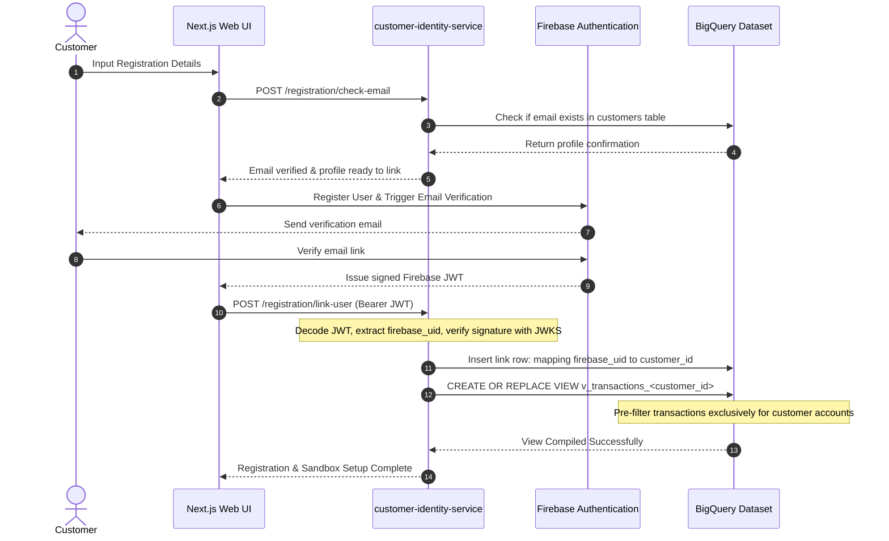
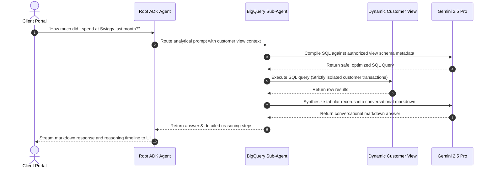

# 🏦 BankPilot: Secure AI Financial Portal

Production-inspired AI Banking Platform featuring Google ADK, Vertex AI Agent Engine, Firebase Authentication, Customer Identity Service, and secure BigQuery tool execution.

[](https://cloud.google.com/vertex-ai)
[](https://adk.dev/)
[](https://cloud.google.com/bigquery)
[](https://firebase.google.com)
[](https://www.terraform.io)

---

## 🎬 Demo

<p align="center">
  
</p>

---

## 🏗️ Architecture Overview

[](docs/images/bankpilot_architecture.svg)

<p align="center">
  <a href="https://excalidraw.com/#json=tiuLVFxKRiD07hCjuK-Zu,zdv4vl9gnJyq2ibLmrY_-w" target="_blank">
    
  </a>
</p>


---

## 📂 Repository Structure

```
banking-agent/
├── ai-banking-assistant/                   # Customer-facing banking assistant (Vertex AI Agent Engine)
│   ├── app/
│   │   ├── agent.py                        # Root ADK multi-agent orchestrator & session lifecycle manager
│   │   ├── fast_api_app.py                 # Local FastAPI server wrapper for debugging & local SSE streams
│   │   ├── prompts.py                      # System instructions & conversational guidelines for Gemini
│   │   ├── tools.py                        # Core agent tools (RAG document retriever, schema context tools)
│   │   ├── app_utils/                      # Reasoning engine adapter, A2A messaging & backend services
│   │   └── sub_agents/
│   │       └── bigquery/                   # Customer NL2SQL sub-agent querying authorized sandbox views
│   ├── deployment/
│   │   ├── local.py                        # Local agent testing runner
│   │   ├── remote.py                       # Vertex AI Reasoning Engine remote deployment runner
│   │   └── terraform/                      # Infrastructure-as-Code for CI/CD & Cloud Run staging
│   ├── deployment_metadata.json            # Active Vertex AI Reasoning Engine resource IDs & GCP metadata
│   ├── tests/                              # Unit, integration, load, and ADK quality evaluation test suites
│   └── pyproject.toml                      # Package specifications & dependencies for ai-banking-assistant
│
├── analytics-copilot/                      # Enterprise Business Intelligence copilot for staff & operations
│   ├── app/
│   │   ├── agent.py                        # Root BI orchestrator routing analytical queries & chart requests
│   │   ├── fast_api_app.py                 # Local FastAPI server wrapper for staff BI endpoints
│   │   ├── prompts.py                      # Enterprise portfolio & cohort analytics system instructions
│   │   ├── tools.py                        # Metric aggregation & BigQuery schema discovery tools
│   │   └── sub_agents/
│   │       ├── bigquery/                   # Enterprise NL2SQL sub-agent querying core banking tables
│   │       └── visualization/              # Chart sub-agent compiling interactive Vega-Lite visual specs
│   ├── deployment/                         # Remote deployment runners and Terraform configurations
│   ├── deployment_metadata.json            # Reasoning Engine runtime IDs for analytics-copilot
│   ├── tests/                              # BI evaluation datasets, response quality tests & load tests
│   └── pyproject.toml                      # Package configuration for analytics-copilot
│
├── customer-identity-service/              # Core authentication & security microservice (FastAPI on Cloud Run)
│   ├── app/
│   │   ├── main.py                         # FastAPI application entry point, CORS & middleware configuration
│   │   ├── config.py                       # Environment configuration & GCP Project/Dataset bindings
│   │   ├── dependencies.py                 # JWT token decoding, signature verification & user dependency injection
│   │   ├── repositories/                   # Data access layer for customer identity, demo users & knowledge docs
│   │   ├── routers/
│   │   │   ├── auth.py                     # User profile retrieval & Firebase token authentication routes
│   │   │   ├── registration.py             # Email availability checks & Firebase UID ↔ Customer ID linking
│   │   │   ├── adk.py                      # Dynamic customer sandbox view compiler & ADK context initialization
│   │   │   ├── knowledge.py                # Banking policy document upload, indexing & retrieval routes
│   │   │   └── demo.py                     # Seed demo personas & instant login switcher endpoints
│   │   ├── schemas/                        # Pydantic request/response data validation models
│   │   ├── services/                       # Business logic (BigQuery view creation, Firebase Admin SDK, RAG)
│   │   └── utils/                          # Logger, custom exceptions, email templates & demo setup scripts
│   ├── tests/                              # Integration tests for auth, metadata & view generation
│   ├── Dockerfile                          # Production container specification for Google Cloud Run
│   └── requirements.txt                    # Service Python dependencies
│
├── customer-data-service/                  # Core banking domain data microservice (FastAPI on Cloud Run)
│   ├── app/
│   │   ├── main.py                         # FastAPI application entry point & CORS configuration
│   │   ├── config.py                       # Environment variables & BigQuery dataset configuration
│   │   ├── dependencies.py                 # Firebase authentication dependencies & bearer token verification
│   │   ├── routers/
│   │   │   └── dashboard.py                # Banking product summary routes (accounts, cards, loans, deposits)
│   │   └── services/
│   │       ├── bigquery_service.py         # Direct structured SQL queries against core banking tables
│   │       └── dashboard_service.py        # Customer financial snapshot aggregation & payload formatting
│   ├── Dockerfile                          # Cloud Run container image specification
│   └── requirements.txt                    # Service Python dependencies
│
├── mcp-server/                             # Model Context Protocol (FastMCP) transaction server (Cloud Run)
│   ├── app/
│   │   ├── server.py                       # FastMCP server setup & protocol transport handlers
│   │   ├── tools.py                        # Tool definitions (transfer_money, pay_credit_card, verify_otp)
│   │   ├── auth.py                         # FastMCP JWT authentication & caller identity validation
│   │   ├── ledger_service.py               # Atomic double-entry ledger engine (simultaneous DEBIT & CREDIT)
│   │   ├── limit_service.py                # Daily spending limit enforcement & beneficiary account validation
│   │   ├── otp_service.py                  # One-time password generation & verification for high-value transfers
│   │   └── schemas.py                      # FastMCP tool input/output data schemas
│   ├── terraform/                          # Terraform infrastructure modules for Cloud Run deployment & IAM
│   ├── tests/                              # Unit & integration tests for ledger, limits, OTP & MCP tools
│   ├── Dockerfile                          # Cloud Run containerization
│   └── requirements.txt                    # FastMCP dependencies
│
├── nextjs/                                 # Full-stack banking web portal & enterprise staff dashboard (Next.js 15)
│   ├── src/
│   │   ├── app/                            # Next.js App Router pages and API endpoints
│   │   │   ├── page.tsx                    # Landing page & persona selector (Customer vs Staff)
│   │   │   ├── dashboard/                  # Customer financial overview dashboard page
│   │   │   ├── accounts/                   # Savings & checking accounts detail page
│   │   │   ├── credit-cards/               # Credit card overview, limits & billing page
│   │   │   ├── loans/                      # Personal & home loan schedules page
│   │   │   ├── fixed-deposits/             # Active fixed deposit certificates page
│   │   │   ├── transactions/               # Searchable historical transaction ledger page
│   │   │   ├── knowledge/                  # Customer banking policy & product search page
│   │   │   ├── staff/                      # Enterprise staff portal (Analytics Copilot & demo manager)
│   │   │   └── api/
│   │   │       ├── run_sse/                # Edge API route proxying SSE streaming from Vertex AI Agent Engine
│   │   │       └── health/                 # Health check proxy across all microservices
│   │   ├── components/
│   │   │   ├── chat/                       # Chat interface, message timeline, session selector & Markdown renderer
│   │   │   ├── staff/                      # Staff portal layout, analytics chat header & BI empty states
│   │   │   ├── ui/                         # Reusable UI component library (buttons, dialogs, cards, sonner)
│   │   │   └── AuthProvider.tsx            # Firebase auth context provider & session listener
│   │   ├── hooks/                          # Custom React hooks (useAuth, useStreaming, useSession, useBackendHealth)
│   │   ├── lib/                            # API clients, session history managers, SSE stream handlers & utilities
│   │   ├── firebase/                       # Client-side Firebase SDK configuration
│   │   └── types/                          # TypeScript definitions for customer profiles, accounts & chat events
│   ├── package.json                        # Frontend dependencies & Next.js build scripts
│   └── tailwind.config.ts                  # Tailwind CSS styling and theme configuration
│
├── bigquery-infra/                         # Infrastructure-as-Code & synthetic data pipelines
│   ├── bq_schema/
│   │   ├── main.tf                         # Terraform BigQuery dataset & table definitions with column metadata
│   │   ├── analytics_views.tf              # Terraform views for staff portfolio intelligence & executive KPIs
│   │   ├── variables.tf                    # Project IDs, region & dataset configuration variables
│   │   └── outputs.tf                      # Exported BigQuery table IDs & dataset self-links
│   ├── data/                               # Pre-generated synthetic CSV datasets (customers, transactions, accounts)
│   └── data_scripts/
│       ├── generate_data.py                # High-fidelity synthetic customer & ledger transaction generator
│       ├── upload_to_bigquery.py           # Automated schema-aware BigQuery CSV upload script
│       └── sync_demo_customers.py          # Script syncing demo customer profiles with Firebase Authentication
│
├── docs/                                   # Architecture documentation & technical specifications
│   ├── images/                             # Official GCP solution architecture diagrams (SVG/PNG) & GIFs
│   ├── architecture.md                     # High-level architecture and design patterns
│   ├── architecture-decisions.md           # Architectural Decision Records (ADRs) & trade-off analysis
│   ├── authentication.md                   # Firebase JWT & zero-trust identity verification guide
│   ├── authorization.md                    # BigQuery dynamic sandbox view isolation specifications
│   ├── customer-identity-service.md        # Identity microservice API reference & flow documentation
│   └── deployment.md                       # Cloud deployment guides for Cloud Run & Vertex AI Agent Engine
│
├── Makefile                                # Unified project automation (dev, test, deploy, seed-data, lint)
├── pyproject.toml                          # Root Python workspace configuration & dependency management
├── uv.lock                                 # Exact pinned Python dependency lockfile
├── .env.example                            # Universal template for local environment variables & GCP settings
└── README.md                               # Primary project documentation & quickstart guide
```

---


## 📖 Project Overview

### The Problem It Solves
Modern financial institutions possess vast data lakes, but extracting real-time personal analytics and executing transaction operations remains bottlenecked by rigid, legacy client portals.

### Why Traditional Generative AI Demos Fail
Most LLM-based database chat assistants are built as proof-of-concept demos with critical structural flaws:
1.  **Direct Database Access**: They allow the LLM to write raw SQL directly against backend database tables, opening catastrophic vectors for prompt-injection SQL execution.
2.  **Unverified Identity Claims**: They rely on identity values passed directly by the client browser (e.g., *"I am customer 123"*), ignoring standard token authentication.
3.  **Lax Ledger Safety**: They write balance updates to loose, non-auditable records, failing basic transactional consistency.

### Our Solution
BankPilot is built on secure, modular, and cloud-native software engineering practices:
*   **Cryptographic Verification**: Validates short-lived Firebase JWT tokens in-memory at the API gateway.
*   **Isolated Data Sandboxes**: Restricts database queries to dynamically compiled, customer-specific BigQuery views.
*   **Structured Ledger Tracking**: Enforces atomic, double-entry ledger transactions (`DEBIT` and `CREDIT` balance records) for all financial operations.
*   **Separation of Concerns**: Splits AI tasks between analytical models (SQL compilers) and action models (execution tools), reducing hallucination risk.

---

## 🔐 Customer Onboarding & Session Flow

A core principle of this architecture is: **Never trust client-side claims.** 

The client UI never passes a raw `customer_id`. Instead, users authenticate via Firebase, and the resulting JWT token is verified by the backend to compile a secure user data sandbox.

### Onboarding & Verification Sequence
The sequence below illustrates the customer registration and view compilation process:


```mermaid
sequenceDiagram
    autonumber
    actor Customer
    participant UI as Next.js Web UI
    participant CIS as customer-identity-service
    participant FA as Firebase Authentication
    participant BQ as BigQuery Dataset

    Customer->>UI: Input Registration Details
    UI->>CIS: POST /registration/check-email
    CIS->>BQ: Check if email exists in customers table
    BQ-->>CIS: Return profile confirmation
    CIS-->>UI: Email verified & profile ready to link
    UI->>FA: Register User & Trigger Email Verification
    FA-->>Customer: Send verification email
    Customer->>FA: Verify email link
    FA-->>UI: Issue signed Firebase JWT
    UI->>CIS: POST /registration/link-user (Bearer JWT)
    Note over CIS: Decode JWT, extract firebase_uid, verify signature with JWKS
    CIS->>BQ: Insert link row: mapping firebase_uid to customer_id
    CIS->>BQ: CREATE OR REPLACE VIEW v_transactions_<customer_id>
    Note over BQ: Pre-filter transactions exclusively for customer accounts
    BQ-->>CIS: View Compiled Successfully
    CIS-->>UI: Registration & Sandbox Setup Complete
```

### Brief Step Explanation:
1.  **Check Email Availability**: The user initiates registration. Next.js requests the backend to verify if a matching customer profile exists in the core banking records.
2.  **Verify & Authenticate**: Once verified, the user registers with Firebase Authentication, completes the email verification handshake, and obtains a cryptographically signed JWT.
3.  **Establish Secure Link**: Next.js sends the JWT to the `customer-identity-service`. The service verifies the signature using Google's public keys (JWKS), extracts the `firebase_uid`, and maps it securely to the database `customer_id`.
4.  **Sandbox Compilation**: The backend dynamically compiles customer-specific BigQuery authorized views, restricting the data context exclusively to accounts owned by that user.

---

## 🤖 Multi-Agent Execution Flow

This chart details how natural language analytical prompts are safely converted into optimized database executions without exposing base tables:


```mermaid
sequenceDiagram
    autonumber
    actor User as Client Portal
    participant ADK as Root ADK Agent
    participant BQA as BigQuery Sub-Agent
    participant BQ_View as Dynamic Customer View
    participant LLM as Gemini 2.5 Pro

    User->>ADK: "How much did I spend at Swiggy last month?"
    ADK->>BQA: Route analytical prompt with customer view context
    BQA->>LLM: Compile SQL against authorized view schema metadata
    LLM-->>BQA: Return safe, optimized SQL Query
    BQA->>BQ_View: Execute SQL query (Strictly isolated customer transactions)
    BQ_View-->>BQA: Return row results
    BQA->>LLM: Synthesize tabular records into conversational markdown
    LLM-->>BQA: Return conversational markdown answer
    BQA-->>ADK: Return answer & detailed reasoning steps
    ADK-->>User: Stream markdown response and reasoning timeline to UI
```

---

## 🎯 Why Google ADK?

Google's **Agent Development Kit (ADK)** was selected as the foundational multi-agent framework rather than building a custom orchestration layer or using alternative libraries.

### Key Architectural Advantages
1.  **Native Gemini Primitives**: Built specifically for Vertex AI, ADK integrates with Gemini's low-latency streaming and system-instruction compilers, bypassing heavy middleware wrappers.
2.  **Tool Abstraction & Isolation**: ADK separates conversational memory from execution capabilities. Sub-agents are restricted to narrow, predefined tool arrays.
3.  **Managed Agent Engine Hosting**: ADK applications package cleanly as stateful `AdkApp` components deployed directly onto **Vertex AI Agent Engine**. This serverless runtime manages execution sandboxing, session state preservation, and fine-grained GCP IAM security.
4.  **Predictable Context Routing**: The framework implements native routing logic that prevents conversational state and variables from bleeding across concurrent user sessions.

### Architecture Trade-offs
*   **The Benefit**: We avoid writing complex, error-prone conversational state managers, LLM tool-calling loops, and custom stream-propagation layers. ADK handles multi-turn state and streaming out-of-the-box.
*   **The Cost**: Standardizing on ADK ties the agent hosting and orchestration directly to the Google Cloud / Vertex AI ecosystem, making multi-cloud container migrations more complex than standard Docker-based FastAPI architectures.

---

## 🔐 Data Security & SQL Accuracy

### Dynamic Sandboxing
BankPilot guarantees data isolation at the database layer. The AI Agent's database credentials grant no read access to the base `transactions` or `accounts` tables. Instead, the `customer-identity-service` creates a custom view pre-filtered on the user's specific account numbers.
If a prompt injection attack attempts to access other users' data, the compiled query executes within the restricted view, which structurally contains no other users' rows.

### Enhancing SQL Compilation with Semantic Metadata
Generative models running text-to-SQL tasks frequently hallucinate table joins and column names. To address this, BankPilot attaches rich, context-heavy metadata descriptions directly to database columns using Terraform:

```hcl
# Example Terraform schema-level documentation
resource "google_bigquery_table" "transactions" {
  dataset_id = "banking_data"
  table_id   = "transactions"
  
  schema = <<EOF
  [
    {
      "name": "account_number",
      "type": "STRING",
      "mode": "REQUIRED",
      "description": "Business meaning: The bank account on which this entry is recorded. Links to accounts, credit_cards, fixed_deposits, or loans."
    }
  ]
  EOF
}
```

The BigQuery agent's retrieval tools pull this column documentation dynamically. Providing deep business-level relationships and context allows Gemini 2.5 Pro to compile queries with exceptional precision, eliminating join hallucinations.

---

## 🔌 API Documentation

All REST routes are hosted under `/api/v1` of the `customer-identity-service`:

| Endpoint | Method | Authentication Required | Purpose |
| :--- | :---: | :---: | :--- |
| `/registration/check-email` | `POST` | No | Checks if user email corresponds to an active customer profile. |
| `/registration/link-user` | `POST` | Yes | Securely links a newly registered `firebase_uid` with a database `customer_id`. |
| `/auth/me` | `GET` | Yes | Decodes credentials to return customer name, segment, and verified KYC flags. |
| `/adk/context` | `GET` | Yes | Creates dynamic BigQuery customer views and returns authorized account limits to initialize ADK. |

---

## 🌐 Deployment Infrastructure

1.  **Frontend Client**: Hosted on **Firebase Hosting** CDN for fast visual assets loading and static JS page deliveries.
2.  **API Microservice**: The FastAPI `customer-identity-service` is containerized and deployed on **Google Cloud Run**, autoscaling from 0 to 10 instances.
3.  **Agent Orchestration**: Deployed directly on **Vertex AI Agent Engine** as a managed `AdkApp`, ensuring secure execution and native tracing.
4.  **Database & Storage**: Maintained on **Google Cloud BigQuery** regional clusters, using clustered partitioning on `transaction_timestamp` to optimize query costs.

---

## 📊 System Statistics

The following statistics represent the current, actual implementation of the BankPilot repository:

| Metric / Component | Verified Repository Value |
| :--- | :--- |
| **Application Services** | **4 Services** (Next.js Web UI, FastAPI Identity Service, FastMCP Server, Google ADK Root Agent) |
| **BigQuery Datasets** | **1 Dataset** (`banking_data`) |
| **Database Tables** | **9 Relational Tables** (Customers, Identity Mapping, Accounts, Beneficiaries, Transactions, Cards, Loans, Deposits, Credit Scores) |
| **Synthetic Customers** | **1,300 profiles** with verified demographics and segmentation (Retail, Wealth) |
| **Synthetic Transactions** | **453,145 records** comprising a multi-year historical double-entry ledger (~56MB) |
| **Cloud Infrastructure** | **Google Cloud Platform** (Vertex AI Agent Engine, Cloud Run, BigQuery, Firebase Auth, Secret Manager, Cloud Logging) |
| **Programming Languages** | **Python 3.10+** (Backend microservices, ADK agents, MCP tools) & **TypeScript / React** (Next.js web portal) |
| **Infrastructure-as-Code** | **HashiCorp Terraform** (automates regional dataset, schema generation, and column-level semantic documentation) |

---

## ⚡ Current Capabilities

### Phase 1 (Implemented)
*   ✅ **Customer onboarding**
*   ✅ **Firebase Authentication**
*   ✅ **Customer Identity Service**
*   ✅ **Customer-scoped BigQuery Views**
*   ✅ **Google ADK SQL Agent**
*   ✅ **Natural language banking queries**
*   ✅ **Cloud deployment**

### Phase 2 (In Progress)
*   ⬜ **MCP Transaction Service**
*   ⬜ **RAG ingestion and retrieval pipeline for answering policy/product related queries**
*   ⬜ **OTP Verification for high amount transactions**
*   ⬜ **CI/CD**
*   ⬜ **Observability**
*   ⬜ **Analytics Copilot**

---


## 💡 Engineering Decisions & Lessons Learned

### 1. Data Sandboxing via Views
*   **Problem**: Direct database table access by LLMs poses extreme risk of cross-tenant data leaks via creative prompt injection.
*   **Decision**: Dynamic compilation of authorized customer views at session startup.
*   **Trade-off**: Increases BigQuery database metadata creation overhead, but achieves complete tenant data separation.
*   **Outcome**: High resistance to data exfiltration attacks; the database strictly isolates user boundaries before the SQL runs.

### 2. Database Column-Level Documentation as Code
*   **Problem**: Standard NL2SQL models frequently hallucinate join fields or field names on custom banking schemas.
*   **Decision**: Manage detailed column documentation and relationships inside Terraform definitions, making schemas the single source of truth.
*   **Trade-off**: Requires strict discipline to update Terraform metadata whenever table structures evolve.
*   **Outcome**: Significantly reduced join-field hallucinations, resulting in reliable query execution.

### 3. UI Scrolling & Layout Boundaries
*   **Problem**: Streaming interactive timelines in web chat interfaces often causes layout shifting and lag on mobile viewports.
*   **Decision**: Enforced rigid native layout scroll boundaries and decoupled streaming timelines from the central chat thread.
*   **Trade-off**: Slightly increases frontend CSS layout complexity.
*   **Outcome**: Perfect rendering performance on small screen devices (Pixel 7 / iPhone SE) with zero layout shifting during live stream rendering.


---

## 🚀 Step-by-Step Setup & Deployment Guide

This guide takes you through forking the repository, setting up Google Cloud Application Default Credentials (ADC), running Terraform to provision BigQuery schemas, generating & uploading synthetic financial datasets, configuring environment variables, running the full stack locally with `make`, and deploying each service to Google Cloud.

---

### 📋 Prerequisites

Before starting, ensure you have the following installed on your machine:
* **Python 3.10+** (Package management is automated via [`uv`](https://docs.astral.sh/uv/))
* **Node.js 18+** & **npm**
* **Google Cloud SDK (`gcloud` CLI)**: [Install Google Cloud SDK](https://cloud.google.com/sdk/docs/install)
* **Terraform (>= 1.0)**: [Install Terraform](https://developer.hashicorp.com/terraform/downloads)
* **A Google Cloud Platform (GCP) Project** with billing enabled and a Firebase project initialized.

---

### Step 1: Fork & Clone the Repository

1. **Fork the Repository**: Click the **Fork** button on the GitHub repository page to create your own copy.
2. **Clone Your Fork**:
   ```bash
   git clone https://github.com/<your-username>/banking-agent.git
   cd banking-agent
   ```
3. **Install Dependencies Across Workspaces**:
   Run the unified installer to automatically set up `uv`, synchronize root and agent Python virtual environments, and install Next.js frontend dependencies:
   ```bash
   make install
   ```

---

### Step 2: Set Up Google Cloud CLI & Application Default Credentials (ADC)

Authenticate your local machine to run `gcloud`, Google ADK Agent tools, and Terraform:

1. **Log in with your Google Account**:
   ```bash
   gcloud auth login
   ```
2. **Set your Active GCP Project**:
   ```bash
   export GCP_PROJECT_ID="your-gcp-project-id"
   gcloud config set project $GCP_PROJECT_ID
   ```
3. **Configure Application Default Credentials (ADC)**:
   This generates a local credential file used by Terraform, BigQuery Python SDK, and ADK Agent Engine:
   ```bash
   gcloud auth application-default login
   ```
4. **Enable Required Google Cloud APIs**:
   ```bash
   gcloud services enable \
     aiplatform.googleapis.com \
     bigquery.googleapis.com \
     run.googleapis.com \
     cloudbuild.googleapis.com \
     secretmanager.googleapis.com \
     iam.googleapis.com
   ```

---

### Step 3: Configure Environment Variables

1. **Root Configuration (`.env`)**:
   Copy the universal configuration template to `.env`:
   ```bash
   cp .env.example .env
   ```
   Open `.env` and fill in your GCP project details and API keys:
   ```bash
   # Google Cloud Settings
   GOOGLE_CLOUD_PROJECT=your-gcp-project-id
   GOOGLE_CLOUD_LOCATION=us-central1
   BQ_PROJECT_ID=your-gcp-project-id
   BQ_DATASET_ID=banking_data

   # Service Account & Credentials (If using a dedicated key file)
   # GOOGLE_APPLICATION_CREDENTIALS=./keys/service-account.json

   # Gemini Foundation Models
   ROOT_AGENT_MODEL=gemini-2.5-pro
   BIGQUERY_AGENT_MODEL=gemini-2.5-pro
   TRANSACTION_AGENT_MODEL=gemini-2.5-flash

   # Microservice URLs (Local Ports)
   IDENTITY_SERVICE_URL=http://localhost:8001
   CUSTOMER_DATA_SERVICE_URL=http://localhost:8081
   MCP_SERVER_URL=http://localhost:8080/mcp

   # Resend Email (OTP Security Challenges)
   RESEND_API_KEY=re_your_resend_api_key
   EMAIL_FROM="BankPilot Security <security@yourdomain.com>"
   ADMIN_EMAIL="admin@yourdomain.com"
   ```

2. **Frontend Configuration (`nextjs/.env.local`)**:
   Create `nextjs/.env.local` and add your Firebase web app configuration:
   ```bash
   # Firebase Web App Config (From Firebase Console > Project Settings)
   NEXT_PUBLIC_FIREBASE_API_KEY="your-firebase-api-key"
   NEXT_PUBLIC_FIREBASE_AUTH_DOMAIN="your-project.firebaseapp.com"
   NEXT_PUBLIC_FIREBASE_PROJECT_ID="your-gcp-project-id"
   NEXT_PUBLIC_FIREBASE_STORAGE_BUCKET="your-project.firebasestorage.app"
   NEXT_PUBLIC_FIREBASE_MESSAGING_SENDER_ID="your-sender-id"
   NEXT_PUBLIC_FIREBASE_APP_ID="your-app-id"

   # Backend Microservice URLs
   NEXT_PUBLIC_IDENTITY_SERVICE_URL="http://localhost:8001"
   NEXT_PUBLIC_CUSTOMER_DATA_SERVICE_URL="http://localhost:8081"
   ```

---

### Step 4: Provision Infrastructure & Seed Datasets

Before deploying or running services, each service requires its underlying Google Cloud infrastructure (BigQuery tables, IAM service accounts, GCS staging buckets, and telemetry datasets).

#### 1. Option A: One-Shot Complete Infrastructure & Data Platform Setup
Execute all Terraform modules and seed BigQuery in a single command:
```bash
# Provisions BigQuery schemas, MCP server infra, and both Agent staging environments
make infra-setup

# Generates synthetic data and uploads to BigQuery
make data-setup
```

#### 2. Option B: Step-by-Step Per-Service Infrastructure Setup

* **BigQuery Data Lake & Semantic Schemas**:
  ```bash
  make bq-setup
  ```
  *Initializes Terraform in `bigquery-infra/bq_schema` to provision the `banking_data` dataset, 9 relational tables, column documentation, and portfolio analytics views.*

* **MCP Transaction Server Infrastructure**:
  ```bash
  make mcp-server-infra
  ```
  *Provisions the dedicated `mcp-server` IAM service account with BigQuery Data Editor permissions, Cloud Run configurations, and service URLs.*

* **AI Banking Assistant Infrastructure (Vertex AI Staging & Telemetry)**:
  ```bash
  make ai-banking-assistant-infra
  ```
  *Provisions the GCS artifact staging bucket (`gs://ai-banking-assistant-*`), Vertex AI Reasoning Engine IAM service accounts, and Cloud Logging telemetry datasets.*

* **Analytics Copilot Infrastructure (Vertex AI Staging & Telemetry)**:
  ```bash
  make analytics-copilot-infra
  ```
  *Provisions the staging storage bucket and IAM roles for the Enterprise BI agent.*

* **Generate & Load Synthetic Datasets**:
  ```bash
  # Generate 1,300 profiles & 450K+ transactions in bigquery-infra/data/
  make generate-data

  # Upload generated CSV datasets into BigQuery tables
  make upload-data
  ```

---

### Step 5: Running the Full Stack Locally

To start the full development environment with hot reloading across all microservices, run:

```bash
make dev
```

This concurrently launches:
| Service | Local URL | Makefile Command | Purpose |
| :--- | :--- | :--- | :--- |
| **Next.js Web Portal** | `http://localhost:3000` | `make dev-frontend` | Client portal & Enterprise Staff dashboard |
| **AI Banking Assistant** | `http://localhost:8000` | `make dev-backend` | Customer ADK reasoning engine REST & SSE stream API |
| **Customer Identity Service** | `http://localhost:8001` | `make identity-service` | Token verification & dynamic BigQuery view sandbox compiler |
| **Customer Data Service** | `http://localhost:8081` | `make customer-data-service` | Core banking summary REST endpoints |
| **Analytics Copilot API** | `http://localhost:8002` | `make analytics-copilot-api` | Staff BI reasoning engine & Vega-Lite chart generator |
| **FastMCP Server** | `http://localhost:8080` | `make mcp-server` | Transaction protocol server & atomic double-entry ledger |

> [!TIP]
> You can also launch the standalone interactive ADK Agent Web Playground to test prompts directly:
> ```bash
> make ai-banking-assistant
> ```

---

### Step 6: Deploying Services to Google Cloud & Firebase (Production)

Once local testing passes, deploy the backend microservices, ADK agents, and the Next.js frontend:

#### 1. Deploy Customer Identity Service to Google Cloud Run
```bash
make deploy-identity-service
```
*Submits container build to Google Cloud Build and deploys `customer-identity-service` to Cloud Run with IAM service account authentication.*

#### 2. Deploy Customer Data Service to Google Cloud Run
```bash
make deploy-data-service
```
*Builds container image and deploys `customer-data-service` to Cloud Run.*

#### 3. Deploy FastMCP Transaction Server to Google Cloud Run
```bash
make deploy-mcp-server
```
*Builds and deploys `mcp-server` to Cloud Run, exposing secure SSE endpoints.*

#### 4. Deploy AI Banking Assistant to Vertex AI Agent Runtime
```bash
make deploy-ai-banking-assistant
```
*Packages the Google ADK multi-agent reasoning engine with all tools and registers the managed agent on Vertex AI Agent Engine (`ReasoningEngine`). Automatically updates `deployment_metadata.json`.*

#### 5. Deploy Analytics Copilot to Vertex AI Agent Runtime
```bash
make deploy-analytics-copilot
```
*Deploys the Enterprise BI agent to Vertex AI Agent Engine.*

#### 6. Deploy Next.js Frontend App to Firebase

You can deploy the Next.js web application to **Firebase Hosting** (with Next.js SSR Web Frameworks support) or **Firebase App Hosting**:

##### Option A: Deploy via Firebase Hosting (Web Frameworks)
1. **Install Firebase CLI & Authenticate**:
   ```bash
   npm install -g firebase-tools
   firebase login
   ```

2. **Enable Web Frameworks & Initialize Firebase in `nextjs/`**:
   ```bash
   cd nextjs
   firebase experiments:enable webframeworks
   firebase init hosting
   ```
   * Select your Firebase/GCP project (`banking-agent-rag-mcp`).
   * Choose `nextjs` directory as the project source.
   * Accept automatic GitHub Actions CI/CD deployment configuration (optional).

3. **Deploy using Makefile target**:
   ```bash
   make deploy-frontend-firebase
   ```
   *Or directly from the `nextjs/` directory:*
   ```bash
   cd nextjs
   npm run build
   firebase deploy --only hosting
   ```

##### Option B: Deploy to Cloud Run (Alternative)
```bash
cd nextjs
gcloud run deploy nextjs-banking-portal \
  --source . \
  --region us-central1 \
  --allow-unauthenticated
```

---

### Step 7: Running Automated Tests & Evals

Run the test and evaluation suites across all microservices and agents:

```bash
# Run unit & integration tests
make test-identity-service
make test-ai-banking-assistant
make test-analytics-copilot
make test-mcp-server

# Run Google ADK Quality Flywheel Evaluations
make eval-ai-banking-assistant
make eval-analytics-copilot
make eval-safety-suite
```

---

*Developed with the Google Agent Development Kit (ADK), Model Context Protocol (MCP), and Google Cloud Platform.*


