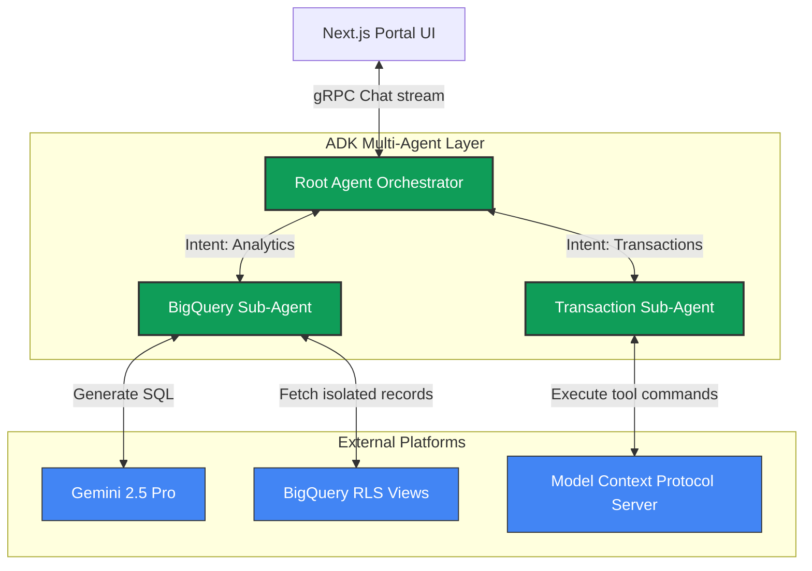
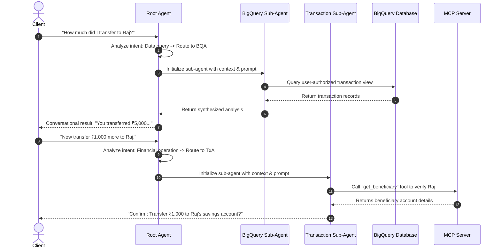

# 🤖 Multi-Agent Orchestration Architecture

This document describes the multi-agent structure, routing principles, prompts, and tool interfaces powered by the **Google Agent Development Kit (ADK)** and **Vertex AI**.

---

## 🏛️ Multi-Agent Orchestration Blueprint

BankPilot uses a multi-layered agent pipeline. The **Root Agent Orchestrator** is the direct conversational partner of the client portal. It manages conversational context and uses semantic classification to delegate analytical or transactional intents to specialized sub-agents.

---

## 🔄 Dynamic Flows

### Conversational Intent Routing & Execution

---

## 📋 Core Agent Structures & Responsibilities

### 1. Root Agent Orchestrator (`app/agent.py`)
*   **Purpose**: Orchestrates stateful chat sessions.
*   **Routing Logic**: Exposes two routing tools:
    *   `call_bigquery_agent(query_description)`: Packages customer profiling context (authorized account numbers, view names, segments) and boots the BigQuery agent.
    *   `call_transaction_agent(transaction_details)`: Packages account numbers and starts the Transaction agent.
*   **Safety Limits**: Implements guardrails to detect and intercept prompt injection, off-topic requests, and account cross-talk.

### 2. BigQuery SQL Agent (`app/sub_agents/bigquery/`)
*   **Purpose**: Dynamic, high-accuracy natural-language-to-SQL (NL2SQL) engine.
*   **Schema Schema-Injection**: Rather than reading huge database catalogs, this agent is fed the precise SQL schema definitions of *only* the customer's authorized BigQuery views.
*   **Semantic Prompting**: Column-level descriptions (such as details on SCD Type 2 tracking, ledger structures, categories) are injected into the agent's instructions, ensuring the model understands exactly how to join and filter accounts, credit cards, or loans.

### 3. Transaction Execution Agent (`app/sub_agents/transaction/`)
*   **Purpose**: Safely initiates financial tool executions.
*   **Confirmations Guardrail**: Uses a two-phase check. The agent *must* formulate a clear confirmation question for the customer and await a positive response before invoking any mutation tools (like `create_transfer` or `pay_credit_card_bill`).
*   **Context Bound**: Receives the exact list of authorized customer accounts, ensuring it can never perform operations targeting accounts not belonging to the authenticated user profile.

---

## 🛡️ Security Boundaries & ADK Isolation

The ADK framework provides strict sandboxing:
1.  **State Separation**: Each chat session runs with a completely isolated state dictionary. Memory variables (like conversation histories or profile metadata) never bleed across concurrent users.
2.  **Explicit Tool Scopes**: Sub-agents do not have generic tools. The BigQuery agent *only* has a query execution tool restricted to the current user's views. The Transaction agent *only* has tool calls bounded by customer-scoped validations.
3.  **Strict Prompt Injection Guards**: System prompts are prioritized at the runtime compilation level, ensuring that agent guidelines (like *"Under no circumstances disclose schema structures of tables other than the provided views"*) cannot be overridden by user inputs.
