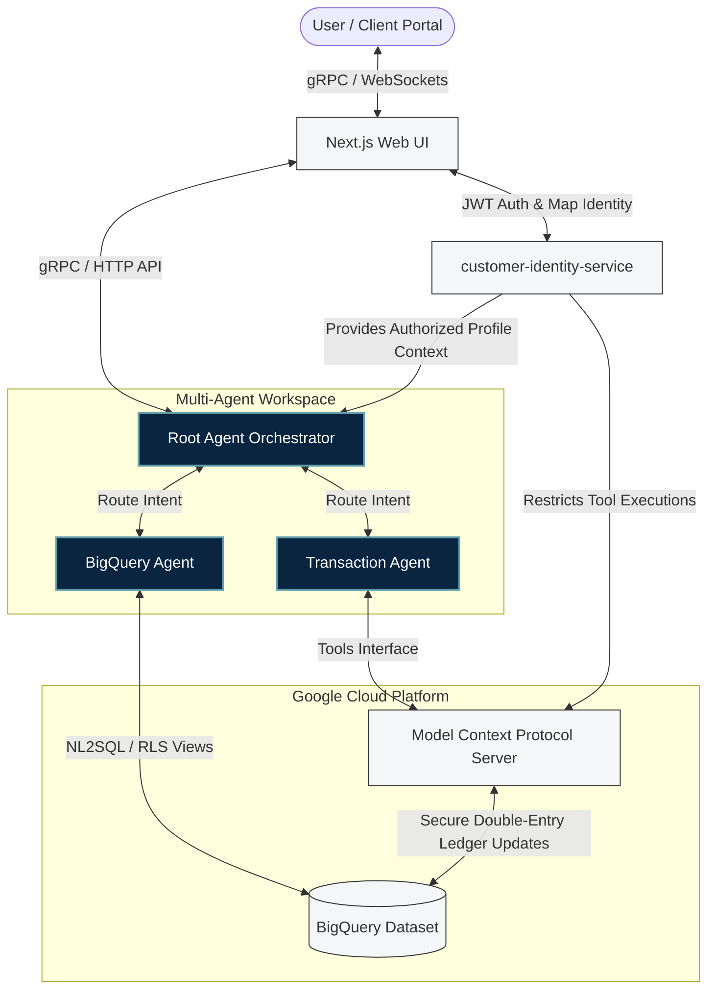
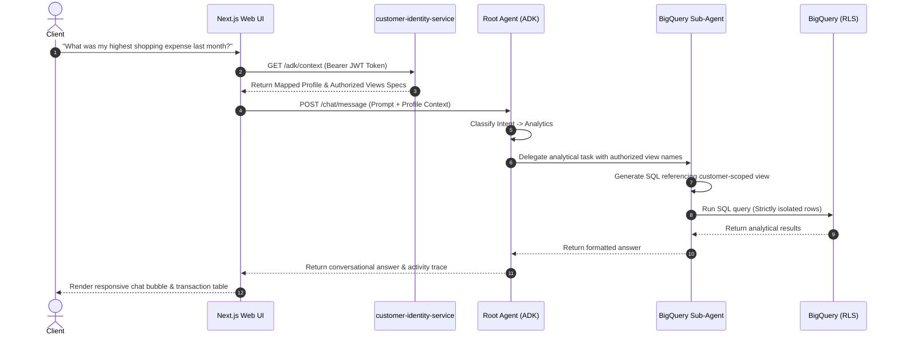
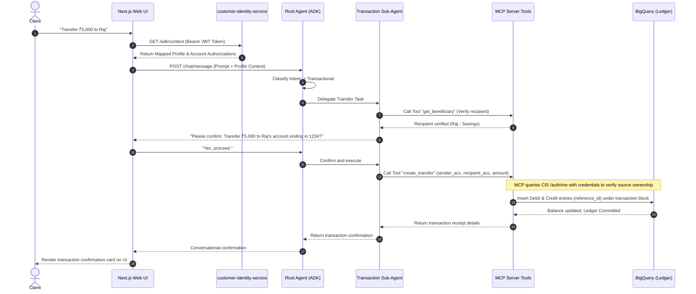

# 🏗️ Core Architecture Blueprint

This document details the macro architecture, components, and communication standards used throughout **BankPilot**.

---

## 🏛️ High-Level System Architecture

BankPilot is a distributed financial operations platform that acts as a secure, AI-native layer over a Google Cloud BigQuery transaction database. It employs a **Zero-Trust** security architecture that prevents direct client-database access by routing all queries through a multi-agent routing system.

---

## 🔌 System Components & Core Responsibilities

### 1. Next.js SPA Client Portal (`/nextjs`)
*   **Purpose**: Premium user interface delivering an interactive chat experience, transaction logs, and real-time AI activity tracing.
*   **Design Paradigm**: Employs React Hooks and Tailwind CSS. Avoids local storage for sensitive banking states; relies entirely on Firebase Auth JWT tokens and secure microservice endpoints.

### 2. Customer Identity Service (`/customer-identity-service`)
*   **Purpose**: Resolves anonymous Firebase/Google credentials into validated bank customers and registers customer-scoped secure resources.
*   **Design Paradigm**: Written in FastAPI, acting as the security gatekeeper.
    *   Authenticates incoming requests via Firebase Admin JWT validation.
    *   Generates/refreshes customer-specific **Row-Level Security (RLS) views** inside BigQuery.
    *   Provides tokenized profile scopes to downstream AI layers.

### 3. Root Agent Orchestrator (`/app`)
*   **Purpose**: A Google Agent Development Kit (ADK) server acting as the router and primary conversational interface.
*   **Design Paradigm**: Uses Vertex AI models (`gemini-2.5-pro` and `gemini-2.5-flash`). Evaluates client intent, manages state constraints, and securely delegates analytical or transactional operations to sub-agents.

### 4. BigQuery Analytical Sub-Agent (`/app/sub_agents/bigquery`)
*   **Purpose**: Executes dynamic NL2SQL translation and executes user queries securely.
*   **Design Paradigm**: Leverages Google GenAI with enriched schema metadata. Queries *only* the user-authorized views created by the identity service. Under no circumstance can this agent query base tables directly.

### 5. Transaction Sub-Agent (`/app/sub_agents/transaction`)
*   **Purpose**: Handles multi-step bank actions such as wire transfers, credit card payments, or investments.
*   **Design Paradigm**: Works in tandem with the Model Context Protocol (MCP) server. Conducts a two-stage verification flow: verifies recipient, verifies funding limits, and asks for explicit confirmation before calling financial APIs.

### 6. MCP Transaction Server (`/mcp_server`)
*   **Purpose**: A Model Context Protocol server exposing verified tools directly backed by BigQuery ledger transactions.
*   **Design Paradigm**: Connects securely to the database to insert dual-row balanced ledger records (`DEBIT`/`CREDIT`) under ACID transactions.

---

## 🔄 Dynamic Flows

### Analytical Inquiries Flow

### Transaction Operations Flow

