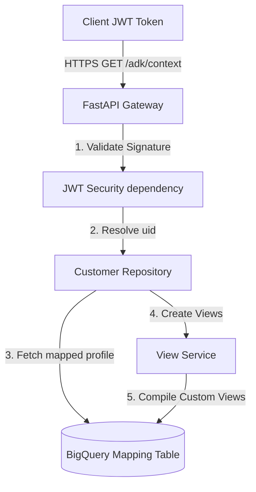

# 👥 Customer Identity Service

The **`customer-identity-service`** is the identity mapping, session creation, and security gateway of the **BankPilot** platform.

---

## 🏛️ Microservice Role & Intent

In standard AI applications, agents are often built as insecure chatbots that have unconstrained backend access. If the frontend says "I am customer X", the agent blindly trusts it. 

The `customer-identity-service` is designed to solve this critical vulnerability by implementing a **Zero-Trust Identity Resolution Gateway**. It acts as a stateless, highly secure bridge between the client credentials layer (Firebase Identity JWTs) and the analytical datastores (BigQuery tables).



---

## 📋 API Endpoints Specification

### 1. Check Email Availability
*   **Endpoint**: `POST /api/v1/registration/check-email`
*   **Authentication**: None
*   **Payload**:
    ```json
    { "email": "customer@example.com" }
    ```
*   **Response**:
    ```json
    { "is_registered": true, "email": "customer@example.com" }
    ```

### 2. Link Firebase User Profile
*   **Endpoint**: `POST /api/v1/registration/link-user`
*   **Authentication**: Firebase Bearer JWT Token Required
*   **Response**:
    ```json
    { "success": true, "message": "User linked successfully" }
    ```

### 3. Retrieve Logged-in Customer Profile
*   **Endpoint**: `GET /api/v1/auth/me`
*   **Authentication**: Firebase Bearer JWT Token Required
*   **Response**:
    ```json
    {
      "customer_id": 1113959832841516,
      "name": "Sourav Maiti",
      "email": "souravmaiti1997@gmail.com",
      "kyc_status": "APPROVED",
      "customer_segment": "WEALTH"
    }
    ```

### 4. Fetch Rich ADK Agent Context
*   **Endpoint**: `GET /api/v1/adk/context`
*   **Authentication**: Firebase Bearer JWT Token Required
*   **Response**:
    ```json
    {
      "customer_id": 1113959832841516,
      "customer_profile": { ... },
      "authorized_views": {
        "v_transactions_1113959832841516": {
          "view_name": "v_transactions_1113959832841516",
          "schema_columns": ["transaction_id", "amount", ...]
        }
      },
      "authorized_account": [
        { "account_number": "ACC_1113959832841516_01", "account_type": "SAVINGS", "balance": 45000.50 }
      ]
    }
    ```

---

## 🏗️ Core Class Architecture

### `CustomerRepository` (`app/repositories/customer_repository.py`)
Encapsulates all BigQuery customer profile reads.
*   **`get_by_id(customer_id)`**: Retrieves full demographic and segment data for a customer.
*   **`get_accounts(customer_id)`**: Fetches checking, savings, credit, and loan structures owned by the user.

### `ViewService` (`app/services/view_service.py`)
Handles dynamic SQL compilation and DDL generation in BigQuery.
*   **`create_authorized_views(customer_id)`**: Generates or replaces the customer's specific views (transactions view, account status views) programmatically.
*   **`get_authorized_views_metadata(view_names)`**: Collects exact table schema parameters and field metadata to pass to the AI Agent.

---

## 🛡️ Security Best Practices Enforced

1.  **Strict Token Signature Checks**: The service relies on the Google Identity public signing keys, refreshed on-the-fly, to verify JWT signatures in real-time.
2.  **Stateless Context Injection**: Because the service is stateless, it compiles the user's authorized data constraints on every session bootstrap. This prevents stale configurations from causing data leaks across subsequent requests.
3.  **Strict Error Handling**: Any authentication failure raises a clean `HTTP 401 Unauthorized` with structured diagnostic information, avoiding stack trace exposure.
