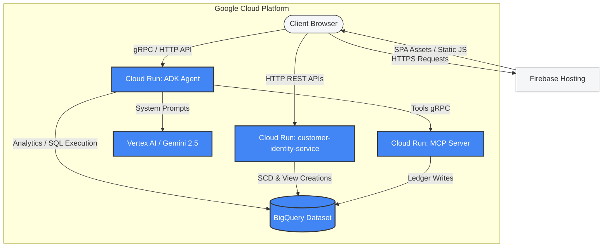

# 🚀 Cloud Deployment Architecture

This document describes the enterprise deployment strategy, Google Cloud Platform (GCP) configurations, and infrastructure-as-code models used for **ApexBanking**.

---

## 🏛️ Deployment Architecture Blueprint

ApexBanking is a cloud-native platform deployed entirely on GCP, utilizing fully managed, containerized services to ensure massive scaling, low latency, and zero-ops maintenance.



---

## 🏗️ Core Infrastructure Components

### 1. Frontend Client: Firebase Hosting
*   **Purpose**: Hosts the static compiled assets of the Next.js single page application (SPA).
*   **Strategy**: Integrated CDN with globally cached responses, ensuring that visual assets, styles, and UI shells load under 500ms.

### 2. Identity Resolver: Cloud Run (`customer-identity-service`)
*   **Purpose**: Containerized FastAPI microservice.
*   **Configuration**:
    *   **Port**: `8080`
    *   **Memory**: 512MB RAM, 1 vCPU
    *   **Scaling Limit**: Auto-scales from 0 to 10 instances based on concurrent HTTP requests.
    *   **Authentication Boundary**: Public HTTP endpoint, utilizing in-memory Firebase Admin SDK key verification.

### 3. Agent Orchestrator: Cloud Run (`adk-agent-server`)
*   **Purpose**: Runs the ADK multi-agent pipeline.
*   **Configuration**:
    *   **Port**: `8501`
    *   **Memory**: 1GB RAM, 2 vCPUs
    *   **Scaling Limit**: Auto-scales dynamically. High CPU settings are applied to speed up long-running JSON generation and parsing cycles.

### 4. Database & SQL Execution: BigQuery
*   **Purpose**: Enterprise analytical database holding the financial profiles and transactional ledgers.
*   **Strategy**: Uses partitioned and clustered tables. RLS views are dynamically created and updated in place.

---

## 🛠️ Infrastructure as Code (IaC) with Terraform

The directory `infra/bq_schema/` contains Terraform configurations that programmatically configure the BigQuery workspace:

```bash
# Navigate to Terraform workspace
cd infra/bq_schema

# Initialize Providers (Google Cloud & HashiCorp)
terraform init

# Generate a detailed execution preview
terraform plan -var="project_id=banking-agent-rag-mcp"

# Create / Sync all GCP BigQuery schemas & configurations
terraform apply -var="project_id=banking-agent-rag-mcp" -auto-approve
```

### Managed Resources:
*   `google_bigquery_dataset.banking_dataset`: Establishes the regional dataset namespace (`banking_data`) with soft deletion protections and encryption-at-rest.
*   `google_bigquery_table.*`: Configures physical table schemas (Customers, Accounts, Transactions, Cards, Loans, FDs, Beneficiaries) and attaches rich **semantic metadata** descriptions to each column to power the NL2SQL generation.
*   `google_storage_bucket`: Establishes regional cloud buckets for bulk CSV pipeline uploads.

---

## 🔄 CI/CD & Deploy Pipelines

ApexBanking is integrated with Google Cloud Build for continuous deployment.

### Deploying customer-identity-service:
```bash
cd customer-identity-service
gcloud builds submit --config cloudbuild.yaml .
```

The cloud build script compiles the Docker container, pushes it to Google Container Registry (GCR), and runs an in-place green-blue release on Google Cloud Run.
